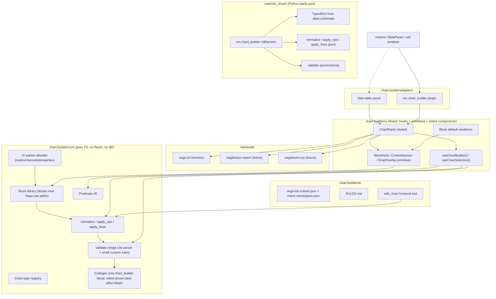

# Chart Builder v2.0 — Implementation Plan

This document covers architecture, contracts, mutation pipeline, persistence, and PR roadmap. Read the [product brief and principles](REQUIREMENTS.md) first.

---

## 1. Architecture overview



Three hard rules:

- `core/` must not import from `ui/`, `backends/`, `adapters/`, `ai/`, `@/*`, or any DOM/React API.
- `ui/` may import from `core/` only (no `backends/`, `adapters/`, or `ai/`).
- `backends/` may import only from `core/`.

Enforced via `oxlint` / `no-restricted-imports`.

The `ui/` package contains both unstyled headless primitives (`useChartBuilder`, `BlockHost`) and the marimo-styled components (`ChartPanel`). If we ever extract the library into a standalone package, the headless primitives can be split into a sub-folder (or a sibling package) at that time — it's a refactor, not an architecture change.

---

## 2. Two consumers, one library — staged delivery

Currently, we have a data-table chart builder and the planned `mo.chart_builder` Python plugin. We want to power both with this new architecture

| | Data-table chart builder | `mo.chart_builder` Python plugin |
| --- | --- | --- |
| Triggered by | Clicking "Chart" on a data table | Writing `mo.chart_builder(df, spec={...})` in a cell |
| State lives in | Browser localStorage (current `tabsStorageAtom`) | The cell source code (the `spec=` arg) |
| Persistence | Ephemeral; tied to a `CellId` + tab id | Persistent in source; survives reload, git, code review |
| Edits write back | jotai atom | Cell source via marimo's source-update channel (like `mo.md` / `mo.sql`) |
| Re-runs on edit | No (local UI only) | Yes (re-runs the cell, re-renders downstream) |
| AI editing | Frontend tool (`edit_chart`) mutates jotai state | Code-mode edits cell source; calls Python plugin methods |
| Selection | Read locally; not surfaced to Python | Surfaced via `chart.value` per standard marimo UI semantics |
| Headless usage | Not applicable | `marimo._charts.normalize(spec, fields)` works without a frontend |

In the steady state, both consumers use:

- The same `chart-builder/core/` (TS) for validate/normalize/build/render
- The same `chart-builder/ui/` (hooks, primitives, and styled chrome) for the panel
- The same block library and chart-type definitions
- The same `usermeta` intent namespace
- The same `RULES.md` for AI guidance

For this feature, we'll ship the `mo.chart_builder` plugin first, and the data-table chart builder will migrate onto the new library later.

## 3. Vega-Lite as the canonical spec

The chart-builder state IS a Vega-Lite spec. There is no separate `ChartConfig` schema layer. Edits read and write specific paths within the Vega-Lite spec. Intent that Vega-Lite cannot express (smart-default markers, chart-type hints) lives in a small `usermeta["marimo.chart_builder"]` namespace that Vega-Lite ignores.

### The shape

```jsonc
{
  "$schema": "https://vega.github.io/schema/vega-lite/v6.json",
  "mark": "bar",
  "encoding": {
    "x": { "field": "date", "type": "temporal", "timeUnit": "yearmonth" },
    "y": { "field": "revenue", "type": "quantitative", "aggregate": "sum" },
    "color": { "field": "category", "type": "nominal" }
  },
  "usermeta": {
    "marimo.chart_builder": {
      "version": 1,
      "chartType": "bar",
      "intent": {
        // Only populated when we need to distinguish auto-applied from user-applied.
        // For v1, this is empty for the common path; see "Intent layer" below.
      }
    }
  }
}
```

### Why this works

When people see Vega-Lite's schema (thousands of definitions, hundreds of properties), the worry is "we can't possibly support all of that." This conflates four distinct subsetting questions:

| Subset question | How big? | Strategy |
| --- | --- | --- |
| **Which marks does the UI offer?** | Tiny (~10 marks) | Curated allowlist per `core/subset.ts`. |
| **Which encoding channels does the UI offer?** | Small (~10 of ~25) | Curated allowlist per mark. |
| **Which encoding properties does the UI offer?** | Small (~15 of ~50) | Curated allowlist per channel. |
| **Which specs does the parser accept?** | **All of them.** | Pass-through. Pure superset. |

**we do not constrain specs to a subset. We render UI controls for a subset and pass through everything else verbatim.** If the spec contains `mark: { type: "bar", cornerRadiusEnd: 3 }`, our UI renders controls for the bar's known properties (mark type, orient, color) and leaves `cornerRadiusEnd: 3` untouched on every write. The chart renders perfectly because Vega-Embed receives the full spec.

This is the "lens over a spec" pattern. Voyager (built by the Vega team itself) is the precedent — see §3.4.

### 3.1 The v1 UI subset

These are the marks, channels, and properties our UI renders controls for in v1. Everything else round-trips losslessly without UI exposure.

```text
Marks (chart types):
  bar, line, area, point (scatter), rect (heatmap), arc (pie/donut)
  (PR 7) boxplot, tick, rule, layered for candlestick

Channels:
  x, y, color, size, shape, opacity
  theta (pie), xOffset (grouped bar)
  tooltip, row, column (facet)

Channel properties:
  field, type, aggregate, bin, timeUnit, sort, stack
  title, axis.title (the user-facing label)
  scale.scheme, scale.domain, scale.range (color)
  scale.type, scale.domain (numeric)

Mark properties:
  mark.type, mark.orient (bar horizontal toggle)
  mark.innerRadius (donut)
  mark.interpolate (line)
  mark.point (line point overlay)

Top-level:
  title, width, height
  config.axis.grid (gridlines)
  resolve.axis.{x,y} (facet linked axes)
```

A single source of truth for the allowlist lives in `core/subset.ts`. Blocks register against it; lint catches blocks that read or write paths outside the allowlist without an explicit opt-in.

### 3.2 The intent layer (`usermeta["marimo.chart_builder"]`)

A handful of behaviors require state that Vega-Lite does not model. We keep this minimal and namespace it under `usermeta`, which Vega-Lite [explicitly preserves but ignores](https://vega.github.io/vega-lite/docs/spec.html).

```ts
interface ChartBuilderUsermeta {
  version: 1;
  chartType: string;                 // canonical id from our registry (bar, line, ...)
  intent?: {
    encoding?: Partial<Record<EncodingChannel, EncodingIntent>>;
  };
}

interface EncodingIntent {
  // Reserved for rare cases where we need to distinguish auto-applied
  // from user-applied. v1 ships with this mostly empty; we add fields
  // only when a concrete UX bug forces us to.
  aggregate?: "auto";   // marks that normalize chose the aggregate
  timeUnit?: "auto";    // marks that normalize chose the time unit
}
```

The default v1 behavior **does not need intent flags** because we adopt a simpler rule that matches Tableau and most chart builders:

- **Normalize is aggressive on add**: when a field is dropped into a channel, normalize chooses sensible aggregate / type / timeUnit.
- **Normalize is conservative on remove**: when a sibling encoding (e.g., color) is removed, normalize does not retroactively un-aggregate. Once the user has committed an aggregate, it stays until they change it.

This rule eliminates the tristate `aggregate: undefined | null | value` complexity we previously needed. The `aggregate` key is either present (user/system committed a value) or absent (no aggregate). `null` is not used.

If a future feature actually needs intent tracking (e.g., "the title was auto-derived from the field name; replace it when the field changes"), we add the narrow `intent` flag at that time. The namespace is reserved for it.

### 3.3 Versioning + migration

`usermeta["marimo.chart_builder"].version` is the migration anchor. v1 is the only version at launch. The migrator is mostly trivial because the spec is Vega-Lite:

- Specs with no `usermeta["marimo.chart_builder"]` (e.g., imported from altair, pasted from a docs site) are valid v1 — we just infer `chartType` from the mark and add a v1 stub on first edit.
- Specs from the legacy `ChartConfig` shape (saved in `tabsStorageAtom` today) are translated to Vega-Lite by `migrateLegacyChartConfig`. The chart builder is experimental; if a legacy config can't be cleanly translated, the user resets the chart.

```ts
function migrate(input: unknown): VegaLiteSpec {
  // 1. Already a Vega-Lite spec? Pass through (and stub usermeta if missing).
  if (isVegaLiteSpec(input)) return ensureUsermetaStub(input);
  // 2. Legacy ChartConfig shape? Translate.
  if (isLegacyChartConfig(input)) return migrateLegacyChartConfig(input);
  // 3. Unrecognized — surface "Reset chart" via soft-failure (§17).
  throw new MigrationError("Unrecognized chart config shape");
}
```

### 3.4 Prior art and divergence

- **Voyager** (built by the Vega team; CHI 2017) is the precedent for a Vega-Lite chart builder.
- **No CompassQL.** Voyager extends Vega-Lite into CompassQL (with wildcards and `encoding: { ... }` flattened to `encodings: Array<...>`) to power their recommendation feature. We do not need recommendations in v1, so we stay byte-compatible with standard Vega-Lite. If we want recommendations later, we add a CompassQL-style wildcard layer inside `usermeta` without touching the spec shape.
- **Altair**'s [`generate_schema_wrapper.py`](https://github.com/vega/altair/blob/main/tools/generate_schema_wrapper.py) provides the Python types we'll reuse (see §14); **data.world Chart Builder** is another Vega-Lite-canonical chart builder;
- **Streamlit's `st.vega_lite_chart`** is the precedent for the "spec in, selection out" UI contract.

### 3.5 Graceful degradation for unknown spec features

The contract for "import any Vega-Lite spec":

1. **Render the chart.** Full spec passes through to Vega-Embed unchanged.
2. **Render UI controls only for paths we recognize.** Walk `core/subset.ts`, render blocks for matching paths.
3. **Show a small "Advanced (edit JSON)" pane** for unrecognized paths the user wants to tweak directly.
4. **Never silently drop unknown paths on write.** Any block that mutates the spec must `deepMerge` rather than `deepReplace`.
5. **Preserve key order** within objects where possible (stable diffs in source).

---

## 4. `mo.chart_builder` — source-authoritative output

A new Python construct, parallel to `mo.md` and `mo.sql`. Lives at the top level of the `mo.` namespace,

### 4.1 Public API

```python
import marimo as mo
import altair as alt

# Empty / inferred chart
chart = mo.chart_builder(df)

# With initial spec (literal or from altair)
chart = mo.chart_builder(
    df,
    spec={
        "mark": "line",
        "encoding": {
            "x": {"field": "date", "type": "temporal"},
            "y": {"field": "revenue", "type": "quantitative"},
        },
    },
)

# Import an existing altair chart
chart = mo.chart_builder(df, spec=alt.Chart(df).mark_bar().encode(...).to_dict())

# Properties (read-only from Python)
chart.spec         # current Vega-Lite spec (after any UI edits)
chart.value        # current selection (Predicate IR / dict) or None
chart.issues       # current validation issues
chart.is_valid     # True iff no errors in issues

# Pure methods (no UI side effects; return new specs)
chart.validate(spec=None)                   # → list[Issue]
chart.normalize(spec=None)                  # → VegaLiteSpec
chart.apply_fixes(fixes=None, spec=None)    # → VegaLiteSpec; fixes: list[Issue] | list[str] | None (apply all fixable)
chart.preview(spec)                         # → VegaLiteSpec (validate + normalize)
chart.apply_ops(ops, spec=None)             # → VegaLiteSpec; internal mutation primitive, not the primary AI surface
chart.to_altair_code(spec=None)             # → str | None; best-effort, intent-driven (PR 12). Walks the recognized
                                            #   chart-type + block decomposition to emit idiomatic Altair
                                            #   (alt.Chart(df).mark_*().encode(...)); returns None for specs that
                                            #   fall outside the recognized subset. Not a general Vega-Lite → Altair
                                            #   converter (see Decisions §22).

# Field metadata (drives smart defaults)
chart.fields                                # list[FieldDescriptor]
chart.field_stats(field)                    # FieldStats (distinct, min/max, nulls)

# Module-level mirrors for headless usage (no plugin, no cell)
mo.chart_builder.validate(spec, fields=fields)
mo.chart_builder.normalize(spec, fields=fields)
mo.chart_builder.apply_fixes(spec, fixes, fields=fields)   # fixes: list[Issue] | list[str] | None
mo.chart_builder.apply_ops(spec, ops, fields=fields)        # internal mutation primitive; not the primary AI surface
```

### 4.2 Source-authoritative semantics

`mo.chart_builder` behaves like `mo.md` and `mo.sql`:

- **The cell source is the source of truth.** The `spec=` arg in the Python cell is the authoritative state.
- **UI edits write back to source.** When the user drags a field or toggles a control, the chart-builder UI calls marimo's existing source-update channel (same channel `mo.md` and `mo.sql` use) to rewrite the `spec=` arg in place.
- **Re-runs on edit.** The cell re-runs after a write-back (with appropriate debouncing — see §18). Downstream cells that depend on `chart.spec` or `chart.value` re-run too.
- **Code-mode is the canonical AI editing path.** An agent edits the cell source (via `cm.get_context().edit_cell(...)`); the chart re-renders. No frontend RPC required.

### 4.3 Edge cases

- **`mo.chart_builder(df)` with no spec.** First UI edit writes the cell as `mo.chart_builder(df, spec={...})`. Same as `mo.md()` → `mo.md("...")`.
- **`mo.chart_builder(df, spec=some_var)`** (non-literal `spec=`). Write-back can't safely rewrite a variable reference. v1 ships a graceful fallback: UI is read-only until the user inlines the spec. A "Save current spec to cell" affordance is a follow-on.
- **Conflict with code-mode.** UI edits and code-mode edits both flow through marimo's source-update channel; last-writer-wins. Same model as `mo.sql`.
- **Stable serialization.** Spec is written with a deterministic pretty-printer (keys in Vega-Lite schema order, 4-space indent, JSON-compatible) to avoid diff churn.

## 5. The Block contract

A block is a self-contained unit that owns a *lens* (read + write) over specific paths in the Vega-Lite spec, renders a piece of UI, and optionally exposes validation, field discovery, normalization, and drag-and-drop targets.

```ts
interface Block<TLens = unknown> {
  id: string;                                // "encoding.x" | "color" | "stacking" | "facet.row"
  label: string;
  category: BlockCategory;                   // for sidebar grouping
  paths: readonly string[];                  // Vega-Lite paths this block reads/writes (subset allowlist)

  // Lens: how to project from the spec to the block's UI state and back.
  read: (spec: VegaLiteSpec) => TLens;
  write: (spec: VegaLiteSpec, lens: TLens) => VegaLiteSpec;
  defaults: TLens;

  // Render the UI.
  render: ControlSection | React.FC<BlockRenderProps<TLens>>;

  visible?: (spec: VegaLiteSpec) => boolean;

  // Optional protocols used by other blocks and the orchestrator.
  normalize?: (lens: TLens, spec: VegaLiteSpec, ctx: BuildContext) => TLens;
  validate?: (lens: TLens, ctx: BuildContext) => Issue[];
  describeFields?: (lens: TLens) => FieldDescription[];
  dropTargets?: (spec: VegaLiteSpec, dragged: FieldDescriptor) => BlockDropTarget[];
}

type BlockCategory = "data" | "encoding" | "transform" | "style" | "facet" | "interaction";

interface Issue {
  id: string;                                // stable per (source, path); used by AI to apply fixes by id
  level: "error" | "warning" | "info";
  message: string;
  source: string;                            // block id or validator id
  path?: string;                             // Vega-Lite path that triggered it
  fix?: { label: string; ops: ChartOp[] };   // optional auto-fix expressed as ChartOps (internal); applied via apply_fixes
}

interface FieldDescription {
  field: string;
  role: string;                              // "x" | "y" | "color" | "facet:row"
  type: DataType;
  aggregate?: AggregationFn;
  timeUnit?: TimeUnit;
  format?: string;
}

interface BlockDropTarget {
  id: string;                                // "encoding.y.replace" | "encoding.color.set"
  label: string;
  accepts: SelectableDataType[];
  position?: "block" | "canvas-top" | "canvas-right" | "canvas-bottom" | "canvas-left" | "canvas-center";
  priority?: number;
  apply: (spec: VegaLiteSpec, field: FieldDescriptor) => ChartOp[];
}
```

The five optional protocols (`normalize`, `validate`, `describeFields`, `dropTargets`, plus `Issue`) are part of the contract from day one so we never refactor blocks to add them later.

### Why each protocol exists

- `read` / `write` — the lens. The block does not own a slice of a separate config; it knows how to read and write specific Vega-Lite paths. This makes the spec the single source of truth.
- `normalize` — pure function that fills in smart defaults based on field types and surrounding spec state (e.g., picking a numeric y auto-sets `aggregate: "mean"`). Runs after every op; see §12. Aggressive on add, conservative on remove.
- `validate` / `Issue` — unified error/warning surface. Powers required-field errors, subplot-count limits, aggregation-on-temporal warnings, and AI auto-fix suggestions. Most structural validation is delegated to the Vega-Lite parser; blocks add semantic rules.
- `describeFields` — lets cross-cutting blocks (tooltips, legend, AI prompts) ask sibling blocks "what fields are you contributing?" without hardcoding paths.
- `dropTargets` — every block declares its own drop semantics, so drag-and-drop UI works automatically as new blocks land.

### Block factories

The block library is exposed primarily as **factories**, not raw block instances. A factory takes config and returns a `Block`. The same factory powers many specializations:

```ts
encodingBlock({
  channel: "x",
  required: true,
  accepts: ["temporal", "number", "string"],
  features: { aggregate: true, bin: true, sort: true, timeUnit: true },
})
encodingBlock({ channel: "y", defaults: { aggregate: "count", field: COUNT_FIELD } })
listBlock<TooltipField>({ id: "encoding.tooltip", itemBlock: tooltipFieldBlock(), min: 0 })
facetBlock({ axes: ["row", "column"], perAxisFeatures: { bin: true, sort: true, linkScale: true } })
axisFormatBlock({ channel: "y" })
```

`listBlock<T>` is the workhorse: it generalizes multi-y, tooltip fields, filter predicates, and layered marks into one primitive that handles "ordered list of T with add/remove/reorder UI."

---

## 6. Spec mutation pipeline

Without a separate `ChartConfig` → spec build step, mutation becomes a small pipeline that operates directly on Vega-Lite specs.

```ts
function applyOps(
  spec: VegaLiteSpec,
  ops: ChartOp[],
  ctx: BuildContext,
): { spec: VegaLiteSpec; issues: Issue[] } {
  // 1. Apply each op (via the block whose paths overlap the op's target).
  let next = ops.reduce((s, op) => applyOp(s, op, ctx), spec);

  // 2. Run every visible block's normalize().
  for (const block of ctx.chartType.blocks) {
    if (block.normalize && (block.visible?.(next) ?? true)) {
      const lens = block.read(next);
      const normalized = block.normalize(lens, next, ctx);
      if (normalized !== lens) next = block.write(next, normalized);
    }
  }

  // 3. Run chart-type normalize() for cross-block smart defaults.
  next = ctx.chartType.normalize?.(next, ctx) ?? next;

  // 4. Validate: Vega-Lite schema first (structural), then block.validate() (semantic).
  const issues = validate(next, ctx);

  // 5. Update usermeta version + chartType.
  next = ensureUsermetaStub(next, ctx.chartType.id);

  return { spec: next, issues };
}
```

There is no longer a `buildSpec` step that constructs a spec from a separate config — the spec IS the state. Blocks read from the spec to render UI; ops write to the spec.

### `mergeSpec` is still useful for layered marks

When a block (e.g., `ohlcBlock` for candlestick) needs to contribute multiple layers, it returns a `layer: [...]` write that's merged with broadcast-style semantics for layout-level encodings:

```ts
mergeSpec(base, contribution) — broadcasts non-layered contributions (x, color, transforms common to all layers) into every layer's encoding/transform when `layer:` is present in either side.
```

This is the same primitive we'd have built anyway. With Vega-Lite as canonical, it operates spec-on-spec instead of contribution-on-base.

---

## 7. Built-in block library

The blocks needed for PR 1 to re-express today's 6 chart types:

| Block factory | Vega-Lite paths it lenses | Purpose |
| --- | --- | --- |
| `encodingBlock` | `encoding.{channel}.*` | A single encoding channel (x, y, color, etc.) with optional aggregate/bin/sort/timeUnit features |
| `listBlock<T>` | various (array-typed) | Generic ordered list of items (powers tooltips, filters, future multi-encoding, future layered marks) |
| `facetBlock` | `encoding.{row,column}.*`, `resolve.axis.*` | Row/column faceting with binning, sort, linked scales |
| `stackingBlock` | `encoding.{x,y}.stack` | Stacked vs grouped (bar/line/area) |
| `orientationBlock` | swaps `encoding.x` ↔ `encoding.y` (or sets `mark.orient`) | Horizontal/vertical |
| `tooltipBlock` | `encoding.tooltip` | Auto vs manual tooltips, uses `describeFields` for auto mode |
| `colorSchemeBlock` | `encoding.color.scale.scheme` | Color scheme picker |
| `colorArrayBlock` | `encoding.color.scale.range` | Explicit color range picker |
| `axisLabelBlock` | `encoding.{channel}.axis.title` | Per-axis label override |
| `gridlinesBlock` | `config.axis.grid` (or per-axis `encoding.{ch}.axis.grid`) | Per-axis gridline toggle |
| `titleBlock` | `title.text`, `title.anchor` | Chart title + alignment |
| `dimensionsBlock` | `width`, `height`, `padding` | Width / height / padding |
| `donutBlock` | `mark.innerRadius` | Pie inner radius slider |

Future blocks (designed-for, not in PR 1):

| Block factory | Adds | Lands in |
| --- | --- | --- |
| `multiEncodingBlock` | List-capable encoding for multi-y / dual-axis (via `layer` or `repeat`) | PR 6 |
| `filterBlock` | Top-level `transform: [{filter: ...}]` using Predicate IR | PR 8 |
| `axisFormatBlock` | `encoding.{ch}.axis.format` | PR 4 |
| `axisScaleBlock` | `encoding.{ch}.scale.type` | PR 4 |
| `axisDomainBlock` | `encoding.{ch}.scale.domain` | PR 4 |
| `axisTicksBlock` | `encoding.{ch}.axis.{tickCount,values,tickMinStep}` | PR 4 |
| `fontBlock` | `config.font`, per-element font properties | PR 4 |
| `dataLabelsBlock` | `mark.text` overlay or text-layer composition | PR 4 |
| `markStyleBlock` | `mark.{opacity,stroke,strokeWidth}`, `mark.point.{size,shape}` | PR 4 |
| `boxplotExtentBlock` / `boxplotOutliersBlock` | Boxplot-specific mark props | PR 7 |
| `ohlcBlock` / `candlestickColorBlock` | Candlestick-specific (uses `layer: [rule, bar]`) | PR 7 |
| `regressionLineBlock` / `referenceLineBlock` / `confidenceBandBlock` | Layered-mark add-ons | future |
| `brushSelectionBlock` / `clickSelectionBlock` / `crossfilterBlock` | Interaction blocks via `params: [...]` | PR 8 |

---

## 8. Chart type definitions

A `ChartTypeDefinition` is composition + a mark. Nothing else.

```ts
interface ChartTypeDefinition {
  id: string;                                // canonical id; stored in usermeta.chartType
  label: string;
  description?: string;
  icon?: string;
  mark: Mark | ((spec: VegaLiteSpec) => Mark);   // resolved mark (string or MarkDef)
  blocks: Block[];
  validate?: ChartValidator[];
  finalize?: (spec: VegaLiteSpec) => VegaLiteSpec;
  normalize?: (spec: VegaLiteSpec, ctx: BuildContext) => VegaLiteSpec;
  isSuitable?: (fields: FieldDescriptor[], rowCount?: number) => number;  // 0..1
}
```

### Bar (re-expressed from current code)

```ts
defineChartType({
  id: "bar",
  label: "Bar",
  mark: "bar",
  blocks: [
    encodingBlock({ channel: "x", required: true,
      accepts: ["string", "temporal", "number"],
      features: { aggregate: true, bin: true, sort: true, timeUnit: true } }),
    encodingBlock({ channel: "y", required: true,
      accepts: ["number", "string"],
      features: { aggregate: true, bin: true, sort: true } }),
    encodingBlock({ channel: "color",
      accepts: ["string", "number", "temporal"],
      features: { aggregate: true, bin: true } }),
    stackingBlock({ visibleWhen: (spec) => isFieldSet(spec.encoding?.color?.field) }),
    orientationBlock(),
    facetBlock(),
    tooltipBlock(),
    colorSchemeBlock(),
    titleBlock(),
    axisLabelBlock({ channel: "x" }),
    axisLabelBlock({ channel: "y" }),
    gridlinesBlock(),
    dimensionsBlock(),
  ],
  normalize: (spec, ctx) => {
    // When color is set, default to stacked (unless user already chose).
    if (isFieldSet(spec.encoding?.color?.field) && spec.encoding?.y?.stack === undefined) {
      return deepSet(spec, "encoding.y.stack", "zero");
    }
    return spec;
  },
});
```

### Pie

```ts
defineChartType({
  id: "pie",
  label: "Pie",
  mark: (spec) => ({
    type: "arc",
    innerRadius: spec.mark?.innerRadius,
  }),
  blocks: [
    encodingBlock({ channel: "color", label: "Color by", required: true,
      accepts: ["string", "number"] }),
    encodingBlock({ channel: "theta", label: "Size by", required: true,
      accepts: ["number", "string"], features: { aggregate: true } }),
    donutBlock(),
    tooltipBlock(),
    colorSchemeBlock(),
    titleBlock(),
    dimensionsBlock(),
  ],
});
```

`line`, `area`, `scatter`, `heatmap` follow the same pattern with appropriate marks and features.

### Forward references (validate the model)

Not in PR 1; they prove the model holds up.

- **Histogram**: 0 new blocks. Pure composition of `encodingBlock` with `bin: true` on x and `aggregate: "count"` on y.
- **Boxplot**: 2 new blocks (`boxplotExtentBlock`, `boxplotOutliersBlock`). `mark: "boxplot"` is a composite mark — Vega-Lite handles the rest.
- **Candlestick**: 2 new blocks (`ohlcBlock`, `candlestickColorBlock`). First chart to use `layer:` end-to-end.

---

## 9. UI layer

A single React package (`chart-builder/ui/`) containing both headless primitives and the marimo-styled components. The headless half is what's referenced by adapters and could be split out later if we ever extract the library; the styled half is the marimo-shaped chrome.

### Headless half — hooks + primitives

```ts
const builder = useChartBuilder({
  dataset,                                   // FieldDescriptor[] + DataSource
  initialSpec,                               // VegaLiteSpec
  chartType,                                 // ChartTypeDefinition
  backend,                                   // ChartBackend instance
  onChange,                                  // (next: VegaLiteSpec) => void
});

builder.spec;                                // current Vega-Lite spec
builder.setChartType(id);
builder.setSpec(spec: VegaLiteSpec);         // public: full replace (normalized + validated)
builder.applyFixes(fixes?: Issue[] | string[]);  // public: apply pre-baked fixes by id or Issue
builder.applyOps(ops: ChartOp[]);            // internal-ish: used by UI form layer + drag-and-drop; not exposed to AI
builder.issues;                              // Issue[]
builder.codegen.moChartBuilder();            // emits mo.chart_builder(df, spec={...}) cell text — always available
builder.codegen.vegaLiteJson();              // raw JSON export — always available
builder.codegen.altair();                    // string | null; best-effort, intent-driven (PR 12). Walks the
                                             // recognized chart-type + block decomposition to emit idiomatic Altair;
                                             // returns null for specs outside the recognized subset.

const selection = useChartSelection(builder);
selection.current;                           // SelectionEvent | null
selection.toPredicate();                     // Predicate IR
selection.applyAsFilter();                   // mutates spec.transform via ChartOps
```

Unstyled primitives:

```tsx
<ChartBuilderProvider value={builder}>
  <BlockHost />                              // renders all visible blocks for the current chart type
  <CanvasDropOverlay />                      // renders drop targets when a column is being dragged
  <ChartPreview />                           // calls backend.render
  <IssueBanner />                            // shows current issues
</ChartBuilderProvider>
```

These primitives have no marimo design-system imports — they're plain React with prop-driven styling hooks. The styled half wraps them.

### Styled half — the marimo default UI

The marimo default chart panel. Renders blocks grouped by `block.category` into tabs/accordions. Used by both adapters (data-table and `mo.chart_builder`).

```text
Data tab          → category: "data" | "encoding" | "transform"
Style tab         → category: "style"
Facets tab        → category: "facet"
Interactions tab  → category: "interaction"
```

Within each category, blocks render top-to-bottom in declaration order. Future: `block.group?: string` for further sub-grouping.

### Adapters

```text
adapters/
  data-table.tsx        # wires panel to jotai/localStorage; "Insert as mo.chart_builder cell" button
  mo-chart-plugin.tsx   # IPlugin wrapper; wires panel to marimo UI value sync + source-update
```

The "Insert as `mo.chart_builder` cell" button bridges the two consumers: from the data-table chart builder, the user can promote their draft spec into a persistent `mo.chart_builder` cell with one click.

### Future extraction

If we ever publish the library standalone, `ui/` splits into two sub-folders (or sibling packages): the headless half (hooks + primitives) becomes `@marimo/chart-builder-react`, and the styled half stays marimo-specific. The split is mechanical because the headless primitives already avoid marimo design-system imports.

---

## 10. Backend abstraction

```ts
interface ChartBackend {
  id: string;
  prepare(spec: VegaLiteSpec, ctx: PrepareContext): Promise<VegaLiteSpec>;
  render(target: HTMLElement, spec: VegaLiteSpec, opts: RenderOptions): RenderHandle;
  loadData?(source: DataSource, query: BackendQuery): AsyncIterable<DataChunk>;
  subscribeSelection?(handle: RenderHandle, cb: (s: SelectionEvent) => void): () => void;
  dispose(handle: RenderHandle): void;
}

type DataSource =
  | { kind: "inline"; values: object[] }
  | { kind: "url"; href: string; format: "csv" | "json" | "arrow" | "parquet" }
  | { kind: "arrow"; table: ArrowTable }
  | { kind: "duckdb"; query: string; conn: DuckDBConnection }
  | { kind: "custom"; load: () => Promise<AsyncIterable<object>> };
```

### Backends

- **`backends/vega/`** — wraps today's [LazyVegaEmbed](frontend/src/components/data-table/charts/lazy-chart.tsx) + [vegaLoadData](frontend/src/plugins/impl/vega/loader.ts) path. `prepare` is identity. Ships in PR 1.
- **`backends/vegafusion-wasm/`** — future. `prepare` pre-aggregates against an Arrow dataset in-browser; `render` falls back to the vega backend with the reduced spec.
- **`backends/vegafusion-py/`** — future. `prepare` ships the spec to the marimo kernel over the existing RPC, receives a reduced spec back. Same contract, different transport.

The chart builder never knows which backend it has. Swap-in is one line in the adapter.

---

## 11. Selection / interactivity

A small algebraic IR shared across charts, table filters, data explorer, and AI-generated SQL.

```ts
type Predicate =
  | { op: "and"; children: Predicate[] }
  | { op: "or"; children: Predicate[] }
  | { op: "not"; child: Predicate }
  | { op: "eq" | "neq" | "lt" | "lte" | "gt" | "gte"; field: string; value: ScalarValue }
  | { op: "in"; field: string; values: ScalarValue[] }
  | { op: "between"; field: string; lo: ScalarValue; hi: ScalarValue }
  | { op: "is-null" | "is-not-null"; field: string };

// core/selection/
toSql(p: Predicate, opts: { table: string; dialect: SqlDialect }): string;
toPandas(p: Predicate, df: string): string;
toPolars(p: Predicate, df: string): string;
toVegaLitePredicate(p: Predicate): VegaPredicate;
simplify(p: Predicate): Predicate;
intersect(a: Predicate, b: Predicate): Predicate;
```

`useChartSelection` exposes:

- `current` — live `SelectionEvent` from the backend.
- `history` — for undo/redo.
- `toPredicate()` — convert to IR.
- `applyAsFilter()` — push into `spec.transform: [{filter: ...}]` via `ChartOps`.
- `applyAsFilter({ invert: true })` — remove selection.
- `drillDown(field)` — open a child builder with the filter applied + group-by the chosen field.
- `crossfilterTo(otherBuilders)` — broadcast filter to other charts.

For `mo.chart_builder` cells, `selection.current` is surfaced to Python as `chart.value`, matching `mo.ui.altair_chart` semantics.

Selection event sources live in [make-selectable.ts](frontend/src/plugins/impl/vega/make-selectable.ts), which moves into `backends/vega/selections.ts` and powers `subscribeSelection`.

---

## 12. Mutation pipeline & smart defaults

Smart defaults ("the chart just does the right thing as you pick columns") are first-class. They run as pure `normalize` functions after every mutation, on both the TS side (UI editing) and the Python side (code-mode / AI self-heal).

### `ChartOp` — the internal mutation primitive

`ChartOp` is the typed union used by the UI form layer, drag-and-drop, and the pre-baked `Issue.fix` payloads. It is **not** the AI surface — agents author full Vega-Lite specs (see §13). The op layer exists because human-driven UI events are naturally small and atomic, and because fixes need to be composable and replayable.

```ts
type ChartOp =
  | { op: "set-chart-type"; type: string }
  | { op: "set-encoding"; channel: EncodingChannel; index?: number;
      field?: string; aggregate?: AggregationFn; bin?: BinSpec; timeUnit?: TimeUnit; type?: SelectableDataType }
  | { op: "clear-encoding"; channel: EncodingChannel; index?: number }
  | { op: "add-encoding"; channel: EncodingChannel; value: EncodingDef }      // multi-y (PR 6+)
  | { op: "set-mark"; props: Partial<MarkDef> }                                // mark.* properties
  | { op: "set-scale"; channel: EncodingChannel; props: Partial<Scale> }
  | { op: "set-axis"; channel: EncodingChannel; props: Partial<Axis> }
  | { op: "add-filter"; predicate: Predicate }
  | { op: "clear-filters" }
  | { op: "set-tooltip"; mode: "auto" } | { op: "set-tooltip"; mode: "manual"; fields: TooltipField[] }
  | { op: "set-facet"; axis: "row" | "column"; value: EncodingDef | null }
  | { op: "set-title"; title: string }
  | { op: "set-dimensions"; width?: number | "container"; height?: number }
  | { op: "set-raw"; path: string; value: unknown };                          // escape hatch for Advanced (edit JSON) pane
```

Three entry points exist in the core; only the bottom two are part of the public AI surface:

```ts
applyOps(spec: VegaLiteSpec, ops: ChartOp[], ctx: BuildContext): { spec: VegaLiteSpec; issues: Issue[] };  // internal: UI / dnd / apply_fixes
setSpec(spec: VegaLiteSpec, ctx: BuildContext): { spec: VegaLiteSpec; issues: Issue[] };                   // public: full replace, then normalize
validate(spec: VegaLiteSpec, ctx: BuildContext): Issue[];                                                  // public: dry-run, no mutation
```

`applyFixes(spec, fixes, ctx)` is a thin wrapper around `applyOps` that looks up `Issue.fix.ops` by id and applies them; it's the public way to act on issues without ever touching `ChartOp` directly.

### Smart-default rules

- **Aggressive on add.** When a field is dropped into a channel, `encodingBlock.normalize` fills in `type` (from field metadata), `aggregate` (if quantitative on y), `timeUnit` (if temporal on x), and so on.
- **Conservative on remove.** When a sibling encoding is removed, normalize does **not** retroactively un-aggregate or re-derive defaults on already-committed encodings.

### Worked examples

`encodingBlock.normalize` (the y channel):

```ts
normalize: (lens, spec, ctx) => {
  if (!isFieldSet(lens.field) || lens.field === COUNT_FIELD) return lens;

  const fieldType = ctx.fields.find(f => f.name === lens.field)?.type;
  const selectedType = lens.type ?? inferVegaType(fieldType);
  const next = { ...lens, type: selectedType };

  // Aggressive on add: smart aggregate for y when newly assigned.
  const isNewlyAssigned = !lens.aggregate && ctx.opSource === "add-encoding";
  if (isNewlyAssigned && ctx.channel === "y") {
    if (selectedType === "quantitative") next.aggregate = "mean";
    else if (selectedType === "nominal") next.aggregate = "count";
  }
  // Smart default: time unit for temporal fields on x.
  if (selectedType === "temporal" && lens.timeUnit === undefined && ctx.channel === "x") {
    next.timeUnit = DEFAULT_TIME_UNIT;
  }
  return next;
}
```

Chart-type `normalize` for bar charts:

```ts
normalize: (spec, ctx) => {
  // Default to stacked when color is present and stack hasn't been set.
  if (
    isFieldSet(spec.encoding?.color?.field) &&
    spec.encoding?.y?.stack === undefined &&
    ctx.opSource === "set-encoding" && ctx.opChannel === "color"
  ) {
    return deepSet(spec, "encoding.y.stack", "zero");
  }
  return spec;
}
```

### Contract rules

- `normalize` must be **pure**. Same inputs → same outputs. No side effects.
- `normalize` must be **idempotent**. `normalize(normalize(x)) === normalize(x)`. Lint-enforced via property tests.
- `normalize` must be **monotone w.r.t. user intent**. Explicit user choices are never overwritten.
- `normalize` must **converge in one pass**. Chart-type `normalize` runs once after all block `normalize`s; we don't loop.

### Where existing logic moves

| Today in [chart-items.tsx](frontend/src/components/data-table/charts/components/chart-items.tsx) | Moves to |
| --- | --- |
| `YAxis` default aggregation (`mean` for number, `count` for string) | `encodingBlock.normalize` |
| `XAxis` time-unit default | `encodingBlock.normalize` |
| `CommonChartForm` "showStacking when color+bar/line" visibility | `stackingBlock.visible` (declarative) |
| Auto-tooltip field selection | `tooltipBlock.normalize` via `describeFields` |

---

## 13. AI integration

The core principle: **agents author full Vega-Lite specs.**. The library's job is to make spec authoring forgiving (smart defaults via `normalize`), validation actionable (`Issue.fix` is pre-baked; agent applies it by id), and the AI surface as small as possible (no custom DSL to learn).

There are **two AI surfaces**, each appropriate to a different consumer:

| Surface | Used for | Ships in | Mechanism |
| --- | --- | --- | --- |
| **Code-mode** (primary) | `mo.chart_builder` cells | PR 1 (public Python API); PR 5 (skill + artifacts) | Agent edits cell source via marimo's existing code-mode infrastructure. Reads `chart.spec` / `chart.fields`, writes the cell source with a new spec, calls `chart.validate()` and `chart.apply_fixes(issues)` to self-heal. |
| **Frontend tool** (`edit_chart`) | Data-table chart builder (ephemeral) | PR M (alongside the data-table migration) | A `FRONTEND_TOOL_REGISTRY` tool whose handler runs in the browser, reads the current spec, replaces it with a new one, or applies pre-baked fixes by id. |

Both surfaces operate on **the same Vega-Lite spec format** and consume the same `RULES.md`, subset schema, and chart-type registry. The agent reasons about charts the same way regardless of which surface is editing.

The frontend tool defers to PR M because it has no consumer before then — the existing data-table chart builder runs on its current `ChartConfig` implementation through PR 1–PR 11 and doesn't gain a `useChartBuilder`-backed state until it's migrated. Code-mode against `mo.chart_builder`, by contrast, works from PR 1 since the public Python API is part of the plugin.

### Why two surfaces

The data-table chart builder's state lives in browser localStorage (no Python object backs it), so the only way for Python code-mode to affect it is via a frontend RPC. Hence the `edit_chart` frontend tool.

`mo.chart_builder` cells live in source code; code-mode is the natural editing path and avoids any RPC. The Python parity port (§14) lets the agent validate/normalize/apply-fixes without round-tripping to the LLM and without a frontend.

### What an agent does in code-mode (the canonical path)

```python
async with cm.get_context() as ctx:
    # Read the user's current chart.
    cell = ctx.cells["sales_chart"]
    current_spec = mo.chart_builder.spec_from_cell(cell)  # parses spec= from source

    # Author or modify.
    next_spec = {
        **current_spec,
        "mark": "line",
        "encoding": {
            "x": {"field": "date", "type": "temporal"},
            "y": {"field": "revenue", "type": "quantitative"},
            # aggregate auto-filled by normalize
        },
    }

    # Self-heal — no LLM round-trip needed for deterministic fixes.
    # apply_fixes is a no-op for issues without a fix, so the loop terminates naturally.
    while (issues := mo.chart_builder.validate(next_spec, fields=cell.dataframe_fields)) and any(i.fix for i in issues):
        next_spec = mo.chart_builder.apply_fixes(next_spec, issues, fields=cell.dataframe_fields)

    # Commit to source.
    ctx.edit_cell(
        "sales_chart",
        code=f"sales_chart = mo.chart_builder(df, spec={pretty_print(next_spec)})",
    )
    ctx.run_cell("sales_chart")
```

Crucially, **smart defaults from §12 fire automatically inside `normalize`**, which `validate` and `apply_fixes` both call internally. The agent does not need to know that picking a numeric y means `aggregate: mean` — it picks the columns; normalize fills in the rest. Likewise, the agent does not construct a fix — `Issue.fix` is pre-baked by the validator, and `apply_fixes(issues)` applies them in one call.

### The frontend tool (`edit_chart`)

For the data-table chart builder, register a single tool in `FRONTEND_TOOL_REGISTRY`. The tool surface mirrors the code-mode API: read the spec + issues, write a new spec, or apply pre-baked fixes by id.

```ts
// adapters/data-table.tsx (or near it)
const editChartTool: FrontendTool = {
  name: "edit_chart",
  description: "Read or replace the user's current data-table chart spec, or apply pre-baked validation fixes.",
  source: "frontend",
  parameters: jsonSchemaFor(z.object({
    action: z.enum(["read", "set", "apply_fixes"]),
    spec: VegaLiteSpecSchema.optional(),       // required for "set"
    fix_ids: z.array(z.string()).optional(),   // required for "apply_fixes"; subset of Issue.id
  })),
  handler: (args, ctx) => {
    if (args.action === "read")        return { spec: ctx.builder.spec, fields: ctx.builder.fields, issues: ctx.builder.issues };
    if (args.action === "set")         return ctx.builder.setSpec(args.spec);
    if (args.action === "apply_fixes") return ctx.builder.applyFixes(args.fix_ids);
  },
};
```

That's the entire frontend-tool surface: three actions, no DSL. The agent never sees `ChartOp`. Issues come back with stable `id`s; the agent picks which fixes to apply and the server applies the pre-baked ops on its behalf.

### What we ship for agents to consume

Four artifacts under `chart-builder/ai/`:

1. **`vega-lite-subset.json`** — JSON Schema of the subset our UI controls (mark allowlist, channel allowlist, property allowlist per channel). Agents can target this subset for maximum compatibility. The Vega-Lite parser still accepts any valid spec.
2. **`intent-namespace.json`** — JSON Schema of `usermeta["marimo.chart_builder"]`. Tiny.
3. **`registry.json`** — chart-type metadata: id, label, required encodings, default mark, suitability hints.
4. **`RULES.md`** — short hand-written guidance on tasteful chart construction. Read by the marimo skill and included in every chart-related turn.

### `ai/RULES.md` (hand-written)

```text
# Chart authoring rules

Charts are standard Vega-Lite specs. You author full specs — there is no DSL.
Wrap them in mo.chart_builder(df, spec={...}) for persistent, source-authoritative
charts. Use the frontend `edit_chart` tool for the data-table chart builder
(ephemeral exploration).

## How to work with the library
1. Read the dataset: `chart.fields` (or `mo.chart_builder.fields_of(df)`). Use
   `stats.distinct`, `stats.min/max`, and `stats.nulls` to pick sensible defaults.
2. Author or modify the full Vega-Lite spec. Don't worry about filling in every
   field — `normalize` does that for you (it runs inside `validate` and `apply_fixes`).
3. Validate: `issues = chart.validate(spec)`. Each Issue has an `id`, a `level`
   (error / warning / info), a human-readable `message`, and — when fixable — a
   `fix.label` describing the proposed change.
4. To resolve fixable issues, pass them back: `spec = chart.apply_fixes(spec, issues)`.
   You can also pass `[issue.id, ...]` to apply only specific fixes, or `None` to
   apply all fixable issues. You never construct the fix yourself.
5. Commit the new spec: rewrite the cell with `mo.chart_builder(df, spec={...})`
   (code-mode) or call `edit_chart` action="set" (frontend tool).

## Chart-type selection
- Time series → mark: line.
- One categorical + one numeric → mark: bar.
- Two numeric → mark: point (scatter).
- Two categorical + one numeric → mark: rect (heatmap).
- One numeric → mark: bar with bin on x and aggregate: count on y (histogram).
- Categorical → numeric distribution → mark: boxplot.

## Encodings
- Prefer temporal on x for line/area charts.
- When x is categorical and y is numeric, aggregate y. The system fills in `mean`
  by default; pick `sum` for count-like quantities (revenue, units), `mean` for
  averages (price, score), `median` when distribution is skewed.
- Use color sparingly; never duplicate x as color unless asked.
- For string y, the system applies `count` automatically — you don't need to
  specify it.

## Performance and clarity
- For >100k rows, prefer aggregated bar over raw scatter.
- For >50 distinct categories on a facet field, bin the field or choose a
  different facet.
- When the chart has too many subplots, the system surfaces an Issue with a
  pre-baked fix. Apply it via `chart.apply_fixes(spec, issues)`.
```

### marimo skill

Skill at `marimo/_server/ai/skills/marimo-charts/SKILL.md` (new, separate from existing chart-related skills):

- Points code-mode at the `mo.chart_builder` API
- Includes `RULES.md` inline
- References the artifact paths for `vega-lite-subset.json` / `registry.json`
- Documents the `edit_chart` frontend tool for non-code-mode environments

The skill itself is ~50 lines of prose and bookkeeping.

---

## 14. Python parity port

The Python side of the chart builder lives at `marimo/_charts/`. It is **not** a full reimplementation of the core — it is a thin layer that delegates schema/types to Altair's `schemapi`-generated code, and ports only the executable pieces that need to run in Python during cell execution and AI self-heal.

### What's in the Python port

```
marimo/_charts/
  __init__.py
  types.py              # re-exports altair.vegalite.v6.schema._typing.TopLevelSpec etc.
  subset.py             # mirrors core/subset.ts (UI allowlist) for AI introspection
  intent.py             # Pydantic model for usermeta["marimo.chart_builder"]
  fields.py             # FieldDescriptor + stats helpers
  validate.py           # jsonschema-based validation + small custom rules
  normalize.py          # per-block + per-chart-type normalize, ported from core
  ops.py                # ChartOp union + apply_ops, ported from core
  fixes.py              # apply_fixes, ported from core
  blocks/               # block normalizers/validators in Python
    encoding.py
    facet.py
    tooltip.py
    ...
  chart_types/          # chart type definitions in Python (mirror of TS)
    bar.py
    line.py
    ...
  cases/                # JSON golden cases consumed by both pytest and vitest
    normalize/
      auto-aggregate-when-grouping.json
      ...
    apply_ops/
    apply_fixes/
```

### What's NOT in the Python port

- React block `render` functions (UI only)
- `BlockHost`, `ChartPanel`, drag-and-drop, `useChartBuilder` (UI only)
- Vega/VegaFusion rendering backends (frontend only)
- Selection IR runtime evaluation against frontend data (frontend only; the Python Predicate IR helpers are part of `marimo/_charts/selection.py`)

### Why this surface is small

Vega-Lite as canonical spec means we don't need to port a `buildSpec` step — the spec IS the state. Validation can delegate to `jsonschema` running against the standard Vega-Lite schema (already a transitive dep of altair). Typed access can delegate to Altair's auto-generated TypedDicts. What's left is the small pure-data layer: `normalize`, `apply_ops`, `apply_fixes`, and the per-block normalize functions (each ~10-20 LOC).

### Altair's `schemapi` gives us Python types for free

Altair downloads the Vega-Lite JSON Schema and regenerates Python `TypedDict`s on every Vega-Lite version bump. We import them directly:

```python
from altair.vegalite.v6.schema._typing import TopLevelSpec, Mark
from altair.vegalite.v6.schema.channels import X, Y, Color
import altair as alt

# Round-trip is free.
chart = alt.Chart.from_dict(user_spec)
chart.to_dict()  # back to spec
```

This is the key finding that made dual-impl cheap: we don't hand-port the Vega-Lite schema to Pydantic. Altair maintains it for us.

### JSON-cases parity test corpus

The shared golden-case corpus at `marimo/_charts/cases/` is consumed by both `vitest` (TS) and `pytest` (Python). Each case file:

```json
{
  "name": "auto-aggregate when grouping by categorical",
  "fields": [
    { "name": "category", "type": "string", "stats": { "distinct": 5 } },
    { "name": "revenue", "type": "number", "stats": { "min": 0, "max": 1000 } }
  ],
  "input": {
    "mark": "bar",
    "encoding": {
      "x": { "field": "category", "type": "nominal" },
      "y": { "field": "revenue", "type": "quantitative" }
    },
    "usermeta": { "marimo.chart_builder": { "version": 1, "chartType": "bar" } }
  },
  "expected": {
    "mark": "bar",
    "encoding": {
      "x": { "field": "category", "type": "nominal" },
      "y": { "field": "revenue", "type": "quantitative", "aggregate": "mean" }
    },
    "usermeta": { "marimo.chart_builder": { "version": 1, "chartType": "bar" } }
  }
}
```

Both implementations run `normalize(input, fields)` and assert deep-equal against `expected`. Any divergence breaks CI. PRs that change behavior must update the golden file.

### Public API surface (Python)

Module-level functions for headless usage:

```python
mo.chart_builder.validate(spec, fields=fields)            # list[Issue]
mo.chart_builder.normalize(spec, fields=fields)            # VegaLiteSpec
mo.chart_builder.apply_fixes(spec, fixes, fields=fields)   # VegaLiteSpec; fixes: list[Issue] | list[str] | None
mo.chart_builder.apply_ops(spec, ops, fields=fields)       # VegaLiteSpec; internal mutation primitive, not the primary AI surface
mo.chart_builder.fields_of(df)                             # list[FieldDescriptor]
mo.chart_builder.chart_types()                             # list[ChartTypeInfo]
mo.chart_builder.spec_from_cell(cell)                      # parses spec= literal from cell source
```

Plus the instance methods on `mo.chart_builder(df, spec=...)` — see §4.1.

### Cell-execution safety

When a `mo.chart_builder(df, spec={...})` cell executes:

1. The Python plugin validates the spec immediately (via the parity port). If invalid, surfaces the issue in the cell output without crashing the cell.
2. If `spec=` is `None`, the plugin initializes an empty spec with `usermeta.chartType = "bar"` (or inferred from `df`).
3. The plugin sends the spec to the frontend over the standard marimo UI element channel.
4. The frontend renders the chart and the chart-builder UI.

The agent doing self-heal can call `mo.chart_builder.validate(...)` and `.apply_fixes(...)` during code-mode execution — no frontend required, no kernel RPC, no LLM round-trip.

---

## 15. Validation & errors

Validation has three layers, each with a clear responsibility:

1. **Vega-Lite schema validation** (structural). Delegated to `vega-lite/build/vega-lite-schema.json` + `ajv` on the TS side, and `jsonschema` against the same file on the Python side. Catches "this is not a valid Vega-Lite spec." Free; runs first.
2. **Block-level `validate`** (semantic). Per-block rules: required-field errors, aggregate-on-temporal warnings, etc. Each block owns rules for its own paths.
3. **Chart-type validators** (cross-block). `ChartTypeDefinition.validate: ChartValidator[]`. Things like `maxSubplotsValidator`, `layeredScaleCompatibilityValidator`.

All three layers contribute to a unified `Issue[]`:

```ts
interface Issue {
  id: string;                                // stable per (source, path); AI uses this to apply fixes by id
  level: "error" | "warning" | "info";
  message: string;
  source: string;                            // "vega-lite-schema" | block id | validator id
  path?: string;                             // Vega-Lite path that triggered it
  fix?: { label: string; ops: ChartOp[] };   // ChartOps are an internal primitive; agents apply via apply_fixes(ids), never construct ops directly
}
```

### Built-in chart-type validators

- `requiredEncodingsValidator()` — checks every required encoding has a field. Auto-fix: prompt user / clear chart.
- `maxSubplotsValidator({ limit })` — estimates `cardinality(row) * cardinality(column)` from `FieldDescriptor.stats.distinct` and errors above limit. Auto-fix: bin the higher-cardinality facet field, or switch to wrap-facet with `maxItems`.
- `layeredScaleCompatibilityValidator()` — when multi-y, warns when units differ wildly without `resolve.scale.y: independent`.
- `aggregationConsistencyValidator()` — warns when some y series aggregate and others don't.

### `FieldDescriptor.stats`

Required input for smart validators and AI suggestions:

```ts
interface FieldDescriptor {
  name: string;
  type: DataType;
  stats?: {
    distinct?: number;
    min?: ScalarValue;
    max?: ScalarValue;
    nulls?: number;
    sampleValues?: ScalarValue[];
  };
}
```

Marimo populates this from existing column-summary infrastructure; absent stats degrade gracefully (validators skip their check).

---

## 16. Drag-and-drop

Each block declares its drop targets:

```ts
interface Block {
  dropTargets?: (spec: VegaLiteSpec, dragged: FieldDescriptor) => BlockDropTarget[];
}
```

Drag flow:

1. User starts dragging a column pill (or a column in marimo's column tray).
2. Canvas overlay component walks all visible blocks, collects `dropTargets`, filters by `dragged.type ∈ target.accepts`.
3. Overlay renders zones at their `position` (canvas-top/right/center/etc.) with `label`.
4. On drop, target's `apply(spec, field)` returns `ChartOp[]`.
5. `builder.applyOps(ops)` mutates the spec, triggering normalize.

The mutation pipeline is identical to form edits and AI ops. There is no separate drag-and-drop state machine; the existing ops infrastructure handles undo/redo and persistence for free.

Drop targets ship behind a feature flag in PR 2; the contract is in PR 1 so blocks declare targets from day one.

---

## 17. Persistence & migration

Two persistence models, one per consumer. The data-table chart builder's migration onto Vega-Lite is staged across two events (user-initiated translation in PR 6, full read-side migration in PR M).

### `mo.chart_builder` cells (source-authoritative) — PR 1

- State lives in the cell source code (the `spec=` arg).
- Persistence is automatic: editing the chart rewrites the cell; saving the notebook saves the chart.
- No separate migration story; users authored the cell with whatever spec they chose, and that spec stays unless they (or code-mode) change it.
- `usermeta["marimo.chart_builder"].version` exists for future schema evolution.

### Data-table chart builder — staged

The existing data-table chart builder keeps its current `ChartConfig` localStorage shape through PR 1 and remains the only persistence path for in-table charts during the interim period. The migration onto Vega-Lite happens in two phases.

**Phase A — PR 6: user-initiated translation.** When the user clicks "Insert as `mo.chart_builder` cell" on the existing data-table chart builder, the current `ChartConfig` is translated to a Vega-Lite spec via `migrateLegacyChartConfig` and emitted as a new `mo.chart_builder(df, spec={...})` cell. The original `ChartConfig` stays in `tabsStorageAtom` untouched. The translator is the same one used in Phase B but invoked at user-initiated latency, not cold-start latency. Failures surface a "Could not translate this chart — edit it manually" toast and produce a `mo.chart_builder(df)` cell (empty spec) the user can populate.

**Phase B — PR M: read-side migration.** When the data-table chart builder is rewired onto the new library, `tabsStorageAtom` reads invoke `migrateLegacyChartConfig` to convert stored `ChartConfig` shapes to Vega-Lite. The storage key is bumped from `marimo:charts:v2` to `marimo:charts:v3` so old code keeps reading v2 untouched (safe rollback). Best-effort: canonical shapes round-trip cleanly; novel or malformed shapes surface a "Reset chart" affordance. Once migrated, the next save writes a Vega-Lite spec.

The chart builder is experimental in both phases; we do **not** owe semantic equivalence to pre-migration renders. Migration tests are unit tests over a handful of hand-authored representative legacy shapes (one per chart type, plus edge cases like missing fields and unknown chart types). No requirement to capture real production data.

### The translator (`migrateLegacyChartConfig`)

Lives in `chart-builder/core/schema/migrate.ts` from PR 1 onward (the function exists before its consumers do — the v1 translator is small enough to write once and reuse). PR 6 wires it to the button; PR M wires it to the storage read. Same code path, same fixtures, same tests.

### Soft failure

If a spec fails to migrate or validate, the chart-builder UI surfaces a "Reset chart" / "Edit JSON" affordance for that tab/cell. The rest of the app keeps working.

---

## 18. Source write-back semantics (`mo.chart_builder`)

How UI edits flow into cell source.

### Mechanism

`mo.chart_builder` uses marimo's existing source-update channel (the same one `mo.md` WYSIWYG mode and `mo.sql` editor use). When the plugin's frontend view calls `onChange(newSpec)`:

1. The frontend serializes `newSpec` with the stable pretty-printer.
2. The frontend sends a `source-update` message keyed by cell + the `spec=` arg location.
3. The frontend code editor rewrites `spec=...` in place.
4. After the debounce window (default 250ms), the cell re-runs.
5. The cell re-construction yields a new `chart_builder` object with the new spec.

### Debouncing

- UI edits debounce at 250ms before write-back. This batches rapid drag operations into single source updates.
- For drag operations (the most rapid type), the UI shows the chart updating optimistically during the drag; the source rewrite + cell re-run happens once on drop.

### Non-literal `spec=` (read-only fallback)

If `spec=` is anything other than a dict literal (e.g., a variable reference, a function call, `**kwargs`), the frontend cannot safely rewrite it. The UI surfaces a read-only badge and disables editing. The user can still see the chart and the current spec; to enable editing, they must inline the spec.

A future "Save current spec to cell" affordance can prompt the user to overwrite their non-literal `spec=` with the current spec value.

### Conflict with code-mode

Both UI edits and code-mode edits flow through the same `source-update` channel. Last writer wins. Same model as `mo.sql`.

### Stable pretty-printer

The Python literal serializer produces deterministic output:

- Keys ordered per Vega-Lite schema canonical order (e.g., `$schema`, `data`, `mark`, `encoding`, `usermeta`)
- 4-space indent, no trailing commas, no `True`/`False` (use Python literals)
- String quoting: double quotes preferred (matches JSON style); fall back to single quotes if string contains double quotes
- Top-level `usermeta` always present (even if just the version stub)

This prevents diff churn from cosmetic key reordering.

---

## 19. Folder structure

```text
frontend/src/components/chart-builder/
  core/                                      # pure TS, no React, no @/
    index.ts
    types.ts                                 # VegaLiteSpec re-exports, ChartOp union, FieldDescriptor, etc.
    subset.ts                                # UI allowlist (marks/channels/properties)
    intent.ts                                # usermeta["marimo.chart_builder"] schema + helpers
    schema/
      vega-lite.ts                           # re-export of vega-lite schema for ajv
      validate.ts                            # validate(spec, fields) → Issue[]
      migrate.ts                             # legacy ChartConfig → VegaLiteSpec
      __tests__/
        migrate.test.ts                      # hand-authored legacy shapes
    registry.ts                              # ChartTypeDefinition registry
    spec/
      merge.ts                               # mergeSpec for layered marks
      finalize.ts
    codegen/
      mo-chart-builder.ts                    # emits mo.chart_builder(df, spec={...}) cell text (PR 1)
      vega-lite-json.ts                      # raw JSON export (PR 1)
      altair.ts                              # PR 12; best-effort intent-driven emitter — uses chart-type +
                                             # block decomposition to produce idiomatic Altair, returns null
                                             # when the spec falls outside the recognized subset
    ops/
      types.ts                               # ChartOp union
      apply.ts                               # applyOps → normalize → validate
      normalize.ts                           # orchestrates per-block + per-chart normalize
      fixes.ts                               # apply_fixes for issues with fix.ops
    selection/
      predicate.ts
      to-sql.ts
      to-pandas.ts
      to-polars.ts
      to-vega.ts
    validators/
      required-encodings.ts
      max-subplots.ts
      layered-scale.ts
      aggregation-consistency.ts
    blocks/                                  # the block library
      base.ts                                # Block interface + helpers (lens-based)
      encoding.ts                            # encodingBlock, multiEncodingBlock
      list.ts                                # listBlock<T>
      facet.ts
      stacking.ts
      orientation.ts
      tooltip.ts
      color-scheme.ts
      color-array.ts
      axis-label.ts
      gridlines.ts
      title.ts
      dimensions.ts
      donut.ts
    chart-types/
      bar.ts
      line.ts
      area.ts
      scatter.ts
      pie.ts
      heatmap.ts
      index.ts                               # registers built-ins
    __tests__/
      spec-snapshot.test.ts
      build-roundtrip.test.ts
      cases-parity.test.ts                   # consumes ../../../../marimo/_charts/cases/**.json
      blocks/                                # per-block unit tests
      ops/                                   # per-op unit tests

  backends/
    types.ts                                 # ChartBackend interface
    vega/
      index.ts                               # current LazyVegaEmbed wrapped
      selections.ts                          # ported from make-selectable.ts
    vegafusion-wasm/                         # placeholder, empty in PR 1
      README.md
    vegafusion-py/
      README.md

  ui/                                        # React layer: hooks + primitives + styled components
    index.ts
    headless/                                # no marimo design-system imports; future extraction candidate
      context.ts
      use-chart-builder.ts
      use-chart-selection.ts
      primitives/
        block-host.tsx
        control-section.tsx
        canvas-drop-overlay.tsx
        chart-preview.tsx
        issue-banner.tsx
    styled/                                  # marimo-shaped chrome built on the headless primitives
      chart-panel.tsx                        # replaces TablePanel chart logic
      icons.tsx                              # icon map (CHART_TYPE_ICON, etc.)
      layouts/                               # current layouts.tsx
      block-renderers/                       # default React renderers per Block primitive
        encoding-renderer.tsx
        list-renderer.tsx
        facet-renderer.tsx
        ...

  adapters/
    mo-chart-plugin.tsx                      # IPlugin wrapper for mo.chart_builder (PR 1)
    # PR M: data-table.tsx                   # wires panel to jotai/localStorage; replaces the current data-table chart builder

  ai/
    index.ts                                 # re-exports of public API agents call from code-mode
    tools.ts                                 # edit_chart frontend tool (FRONTEND_TOOL_REGISTRY)
    rules.md                                 # hand-written authoring rules
    vega-lite-subset-export.ts               # generates ai/vega-lite-subset.json at build time
    intent-namespace-export.ts               # generates ai/intent-namespace.json at build time
    registry-export.ts                       # generates ai/registry.json at build time
    __tests__/
      schema-snapshot.test.ts
      tool-roundtrip.test.ts

  README.md                                  # architecture summary, links to this plan

marimo/_charts/                              # Python parity port (see §14)
  __init__.py
  types.py                                   # re-exports altair.vegalite.v6.schema._typing.TopLevelSpec
  subset.py                                  # mirrors core/subset.ts
  intent.py                                  # Pydantic model for usermeta namespace
  fields.py                                  # FieldDescriptor + stats helpers
  validate.py                                # jsonschema-based + small custom rules
  normalize.py                               # ports core/ops/normalize.ts
  ops.py                                     # ports core/ops/types.ts + apply.ts
  fixes.py                                   # ports core/ops/fixes.ts
  blocks/                                    # block normalizers/validators in Python
    encoding.py
    facet.py
    tooltip.py
    ...
  chart_types/                               # chart type definitions in Python
    bar.py
    line.py
    ...
  selection/                                 # Predicate IR helpers
    predicate.py
    to_sql.py
    to_pandas.py
    to_polars.py
  cases/                                     # JSON golden cases (shared with TS via path)
    normalize/
    apply_ops/
    apply_fixes/
  tests/
    test_normalize.py                        # consumes cases/normalize/**.json
    test_apply_ops.py
    test_apply_fixes.py
    test_validate.py

marimo/_plugins/ui/_impl/                    # (existing folder; new file added)
  ...                                        # existing plugins (slider, dropdown, etc.)

marimo/                                      # new top-level module
  chart_builder.py                           # the mo.chart_builder Python plugin (delegates to _charts/)
```

Through PR 1–PR 11, the existing [`frontend/src/components/data-table/charts/`](frontend/src/components/data-table/charts/) directory is **untouched** (one small additive change in PR 6 adds the "Insert as `mo.chart_builder` cell" button; everything else remains the current `ChartConfig`-based implementation). In PR M (the data-table migration), `TablePanel` is reduced to a thin wrapper that imports from `chart-builder/adapters/data-table.tsx`, and the old `charts/` folder is removed. See §21 PR M for the cutover plan.

---

## 20. Module boundaries

Enforced by `eslint-plugin-import` / `oxlint` `no-restricted-imports` rules:

| From | Cannot import from |
| --- | --- |
| `core/` | `ui/`, `backends/`, `adapters/`, `ai/`, `@/*`, any DOM/React API |
| `ui/headless/` | `ui/styled/`, `backends/`, `adapters/`, `ai/`, `@/components/ui/*` (no marimo design system) |
| `ui/styled/` | `adapters/`, `backends/`, `ai/` |
| `backends/` | `ui/`, `adapters/`, `ai/` |
| `ai/` | `ui/`, `backends/`, `adapters/` |
| `adapters/` | (no further restrictions; this is the marimo-integration layer) |

Allowed:

- `ui/headless/` → `core/`
- `ui/styled/` → `ui/headless/`, `core/`, `@/*` (marimo design system OK here only)
- `backends/` → `core/`
- `ai/` → `core/`
- `adapters/` → everything

Python:

- `marimo/_charts/` may not import from `marimo/_runtime/` (keep the parity port pure-data).
- `marimo/chart_builder.py` (the plugin) bridges `_charts/` to `_plugins/ui/_core/`.

These rules make future extraction to a standalone npm package a small refactor: `core/ + ui/headless/ + backends/ + ai/` move out cleanly; `ui/styled/` and `adapters/` stay marimo-specific. We don't proactively maintain a separate `react/` package today, but the boundary between `ui/headless/` and `ui/styled/` (lint-enforced as "no marimo design-system imports in headless") preserves the option.

---

## 21. PR roadmap

Each PR is independently reviewable and shippable. The roadmap follows the staged delivery from §2: PR 1 ships the foundation library plus `mo.chart_builder` (greenfield, low-risk); the existing data-table chart builder stays on its current implementation and migrates in a discrete PR M after `mo.chart_builder` reaches feature parity.

### PR 1 — Foundation library + `mo.chart_builder` (architectural commit)

The first PR delivers a single user-facing feature (`mo.chart_builder`) backed by the full new architecture. Every piece in the library is exercised by exactly one consumer, which keeps the design honest without forcing a data-table migration at the same time.

Scope:

**Library — `frontend/src/components/chart-builder/`** (greenfield directory; the existing `data-table/charts/` is **not** touched):

- Define `core/subset.ts` (UI allowlist of marks/channels/properties) and `core/intent.ts` (`usermeta["marimo.chart_builder"]` namespace, version 1).
- Implement the `Block` interface with lens-based `read`/`write` and all optional protocols (`normalize`, `validate`, `describeFields`, `dropTargets`, `Issue`). Contract for `layer` and multi-encoding shapes is supported by `mergeSpec` but not exercised by PR 1 chart types.
- Implement `applyOps` + the `normalize` pipeline (§12): aggressive on add, conservative on remove; per-block + per-chart-type `normalize` both run on every op.
- Implement the block factories needed by today's 6 chart types (§7).
- Re-express bar, line, area, scatter, pie, heatmap as `ChartTypeDefinition`s, with smart-default `normalize` matching today's behavior in the existing data-table chart builder.
- React layer under `ui/`: headless half (`ui/headless/`) with `useChartBuilder`, `useChartSelection` stub, `ChartBuilderProvider`, `BlockHost`, `ChartPreview`, `IssueBanner`; styled half (`ui/styled/`) with `ChartPanel`.
- `backends/vega/` wrapping today's `LazyVegaEmbed` + `vegaLoadData` path.
- Implement `migrateLegacyChartConfig` (§17) in `core/schema/migrate.ts` with hand-authored fixtures per chart type. The function is unused in PR 1 but exists for PR 6 and PR M to wire up.
- Enforce import-boundary rules (§20) in lint config.

**Python parity port — `marimo/_charts/`** (minimum-viable subset that backs `mo.chart_builder`'s public API):

- `validate`, `normalize`, `apply_ops`, `apply_fixes` ported from TS.
- Per-block normalize functions for the blocks that ship in PR 1.
- Per-chart-type normalize functions for the 6 PR 1 chart types.
- JSON golden-case corpus at `marimo/_charts/cases/`. Both `vitest` (TS) and `pytest` (Python) consume it.
- `marimo._charts.fields_of(df)` powered by existing column-summary infrastructure.
- Module-level mirrors: `mo.chart_builder.validate(...)`, `mo.chart_builder.normalize(...)`, `mo.chart_builder.apply_ops(...)`, `mo.chart_builder.apply_fixes(...)`, `mo.chart_builder.fields_of(df)`, `mo.chart_builder.chart_types()`.
- Does **not** include block normalizers for blocks not in PR 1 (those land alongside their TS counterparts in later PRs).
- Does **not** include the AI skill (that's PR 5) or `edit_chart` frontend tool (that's PR M).

**Plugin — `mo.chart_builder`**:

- `marimo/chart_builder.py` (the UIElement) — validates spec at cell-execute time via the parity port, surfaces issues in cell output.
- `chart-builder/adapters/mo-chart-plugin.tsx` (the IPlugin frontend wrapper).
- Source write-back integration (§18): UI edits rewrite `spec=` in cell source via marimo's existing channel; 250ms debounce; cell re-runs on commit.
- Stable pretty-printer for spec literals.
- `chart.spec` / `chart.value` properties; instance methods (`.validate()`, `.normalize()`, `.apply_ops()`, `.apply_fixes()`, `.preview()`, `.fields`, `.field_stats()`). `.to_altair_code()` is deferred to PR 12 (see §21).
- Non-literal `spec=` fallback: read-only badge (see §4.3).
- Ships behind an experimental flag (`mo.chart_builder` is gated; promoted to stable after PR 5 ships the AI surface).

**Tests**:

- Per-block unit tests (TS + Python).
- Per-`ChartOp` unit tests.
- Property-based idempotence + monotonicity tests on every `normalize`.
- Hand-authored migration fixture tests for `migrateLegacyChartConfig` (one per chart type plus edge cases).
- Vega-Lite import-roundtrip test against ≥20 specs from the [example gallery](https://vega.github.io/vega-lite/examples/) (asserts JSON-equality modulo `usermeta` stub).
- JSON-cases parity tests for `normalize` / `apply_ops` / `apply_fixes` (both `vitest` and `pytest` consume `marimo/_charts/cases/`).
- Playwright E2E spec for `mo.chart_builder`: render a cell, switch chart type, pick columns, observe write-back, observe cell re-run.

Out of scope (contract ships, behavior doesn't):

- Drag-and-drop UI — `dropTargets` is in the block contract; the canvas overlay component is PR 2.
- Multi-y / dual-axis — `multiEncodingBlock` is PR 7.
- Layered marks — `mergeSpec` handles layer broadcasting; no PR 1 chart type uses it.
- New chart types (histogram/boxplot/candlestick) — PR 8.
- VegaFusion backends — PR 10/11.
- `RULES.md` / AI skill — PR 5. Frontend `edit_chart` tool — PR M (no second consumer needs it before then). Code-mode can still drive `mo.chart_builder` in PR 1 via the public Python API; the AI skill simply makes that easier.
- New styling blocks (axis format/scale/domain/ticks, font, dataLabels, markStyle) — PR 4.
- Issue UI banner with auto-fix buttons — PR 3 (the `Issue[]` data is produced in PR 1; PR 3 wires it into the UI).
- The "Insert as `mo.chart_builder` cell" button on the existing data-table chart builder — PR 6.
- Any change to `frontend/src/components/data-table/charts/` — PR 6 (one small additive change) and PR M (full migration).

Acceptance:

- A `mo.chart_builder(df, spec={...})` cell renders, accepts UI edits, and writes back to source within the debounce window.
- A `mo.chart_builder(df)` with no spec works; first edit promotes the cell to `spec={...}`.
- `chart.spec`, `chart.value` (initial value: `None`), `chart.validate()`, `chart.normalize()`, `chart.apply_ops()`, `chart.apply_fixes()` all behave as documented in §4.1.
- Non-literal `spec=` falls back to read-only mode with a badge (§4.3).
- The existing data-table chart builder works **exactly as before** — no code path touched.
- Unit tests (TS + Python), parity tests, and the generative test harness all pass; visual regression baseline for `mo.chart_builder` is captured and stable.
- Playwright E2E covers the `mo.chart_builder` happy path including source write-back.
- Hand-authored migration unit tests pass for `migrateLegacyChartConfig` (verifies the translator works for PR 6 / PR M consumers; the function is unused in PR 1).
- Import-boundary lint rules from §20 are in place and enforced.
- `core/README.md` documents the block contract with at least one worked example; `mo.chart_builder` Python API has a complete docstring matching marimo's documentation style.
- Adding `boxplotChartType` in a follow-up PR requires exactly: 1 new chart-type file + 2 new block files. No edits to core.

### PR 2 — Drag-and-drop UI

Implement `CanvasDropOverlay`. Wire blocks' `dropTargets` to the overlay. Add drop semantics to `encodingBlock`, `facetBlock`, `colorSchemeBlock`. Available in `mo.chart_builder` immediately; behind a feature flag initially.

### PR 3 — Issue surface + validators

Wire `Issue[]` into the `mo.chart_builder` UI as an inline banner. Implement `requiredEncodingsValidator`, `maxSubplotsValidator` (with auto-fix), `aggregationConsistencyValidator`. Display `Issue.fix` as a one-click button that calls `applyOps(fix.ops)`. `FieldDescriptor.stats` is already populated in PR 1; this PR consumes it.

### PR 4 — Styling block expansion

Add `axisFormatBlock`, `axisScaleBlock`, `axisDomainBlock`, `axisTicksBlock`, `fontBlock`, `markStyleBlock`, `dataLabelsBlock`. Each adds a matching Python normalizer in `marimo/_charts/blocks/`. Each is independently testable and additive. Style tab of `mo.chart_builder` gets richer; nothing else changes.

### PR 5 — AI integration (code-mode + skill)

Ship the AI surface for `mo.chart_builder`:

- `chart-builder/ai/index.ts` public API exports.
- Build-time `vega-lite-subset.json` / `intent-namespace.json` / `registry.json` exports.
- `RULES.md` (hand-written tasteful authoring guidance).
- New marimo skill at `marimo/_server/ai/skills/marimo-charts/SKILL.md` documenting the code-mode-on-`mo.chart_builder` flow and pointing at the artifacts.
- Snapshot tests on the build-time artifacts so silent drift fails CI.
- Integration test: code-mode self-heal loop converges on a valid spec without LLM involvement.

No `edit_chart` frontend tool yet (there is no second consumer that needs it; it ships with PR M alongside the data-table adapter). Code-mode is the canonical AI editing path for `mo.chart_builder` and works in PR 1 against the public Python API; PR 5 only adds discovery (skill) and structured artifacts (subset/registry JSON).

After PR 5 lands, promote `mo.chart_builder` out of the experimental flag.

### PR 6 — "Insert as `mo.chart_builder` cell" bridge button

The one and only change to the existing data-table chart builder during the interim period. Adds a button that translates the current `ChartConfig` to a Vega-Lite spec (via `migrateLegacyChartConfig` from PR 1) and emits a new `mo.chart_builder(df, spec={...})` cell.

Scope:

- Add the button to `TablePanel`'s chart toolbar (≤ 20 LOC in existing code).
- Wire `migrateLegacyChartConfig(currentConfig)` → cell-source emission via marimo's existing cell-insert API.
- On translator failure, emit `mo.chart_builder(df)` (empty spec) plus a toast.
- E2E test (TEST-E2E-9): click the button on a populated chart; assert the new cell renders the same chart.

This is the user-facing graduation path. It validates `migrateLegacyChartConfig` against real user input at user-initiated latency before PR M wires it into the storage-read path.

### PR 7 — Multi-y / dual-axis

Add `multiEncodingBlock` factory and its Python normalizer. Update `barChartType` and `lineChartType` to use it on y. Add `axisDomainBlock({ channel: "y2" })`. This is the first real use of layered specs, exercising `mergeSpec`'s layer broadcasting that's been in the contract since PR 1.

### PR 8 — New chart types

`histogramChartType` (no new blocks), `boxplotChartType` (+ `boxplotExtentBlock`, `boxplotOutliersBlock`), `candlestickChartType` (+ `ohlcBlock`, `candlestickColorBlock`). Each is ~one file plus its blocks plus matching Python normalizers. Validates the architecture under load. Candlestick is the first chart to use `layer:` end-to-end.

### PR 9 — Selection IR + interactive filters

Port [make-selectable.ts](frontend/src/plugins/impl/vega/make-selectable.ts) into `backends/vega/selections.ts`. Implement `useChartSelection`. Add `Predicate` IR + converters (`toSql`, `toPandas`, `toPolars`, `toVegaLitePredicate`). Add `filterBlock` + `brushSelectionBlock` + `clickSelectionBlock`. Ship "apply selection as filter" UI affordance. For `mo.chart_builder` cells, surface selection as `chart.value`.

### PR 10 — VegaFusion-WASM backend

Add `backends/vegafusion-wasm/`. Single line change in the `mo.chart_builder` adapter to use it for large datasets. Unblocks "render 50M-row charts in browser" for `mo.chart_builder`.

### PR 11 — VegaFusion-Python backend

`backends/vegafusion-py/` over marimo's kernel RPC. Same renderer, server-side data prep. Best perf for hosted notebooks.

### PR 12 — Best-effort Altair codegen (optional, deferable)

Adds `core/codegen/altair.ts` (TS) and a mirrored `marimo/_charts/codegen/altair.py` (Python, for `chart.to_altair_code()`). Both are intent-driven emitters: they walk the same `ChartTypeDefinition` + block decomposition the UI uses and emit idiomatic Altair (`alt.Chart(df).mark_*().encode(...).transform_*().properties(...)`). Each block whose lens is fully expressible in Altair declares an optional `toAltair?(spec) → AltairFragment` method; the emitter composes those fragments. Specs that fall outside the recognized subset (imported raw Vega-Lite, layered/concat/repeat that no chart type claims, unknown encodings) **return `null` / `None`** — the UI surfaces "Copy as Vega-Lite JSON" or "Copy as `mo.chart_builder` cell" instead.

Why this works: we have ground truth on user intent (the chart type they picked, the blocks they configured). We never need to reverse-engineer arbitrary Vega-Lite — which is the brittle problem Altair maintainers explicitly removed and don't intend to ship (see [vega/altair#913](https://github.com/altair-viz/altair/issues/913), [#3757](https://github.com/vega/altair/discussions/3757)).

Scope:

- `core/codegen/altair.ts`: dispatcher over `ChartTypeDefinition` + `block.toAltair?()`; recognizes shorthand encoding strings (`'a:Q'`), `mark_*()`, `encode()`, `transform_*()`, `configure_*()`, `properties()`.
- Per-block `toAltair?()` for the PR 1–4 blocks; per-chart-type `toAltair?()` for the 6 PR 1 chart types + histogram/boxplot/candlestick (PR 8).
- Python mirror in `marimo/_charts/codegen/altair.py` powering `chart.to_altair_code()`.
- Snapshot tests on the JSON golden-case corpus: every case either emits valid Altair (executed in `pytest`, asserts `chart.to_dict()` round-trips to the input modulo `usermeta`) or returns `None` with a recognized reason.
- "Copy as Altair" button in the styled `ChartPanel`; hidden when the emitter returns `null`.

Out of scope:

- Round-tripping arbitrary Vega-Lite (use Vega-Lite JSON export instead).
- Emitting Altair for layered/concat/repeat specs that no `ChartTypeDefinition` claims.
- A `chart.to_altair()` that returns an Altair `Chart` object (would require eval-ing the emitted code; not worth the complexity over `alt.Chart.from_dict(chart.spec)`).

This PR is independent of PR M and not on its critical path; it can ship before or after.

### PR M — Data-table chart builder migration

**Trigger:** PR 8 (new chart types) is shipped and `mo.chart_builder` is at or past feature parity with the existing data-table chart builder per the parity checklist (§22). Until the checklist is green, the data-table chart builder stays on its current implementation.

Scope:

- Add `adapters/data-table.tsx` wiring `TablePanel`'s chart toolbar onto the new library.
- Bump `tabsStorageAtom` key from `marimo:charts:v2` to `marimo:charts:v3`. On read, invoke `migrateLegacyChartConfig` (the same function PR 6 already uses). Safe rollback: old code keeps reading v2 untouched.
- Add the `edit_chart` frontend tool (see §13) — this is the first PR with a second consumer that needs frontend-side AI.
- Delete `frontend/src/components/data-table/charts/` once `TablePanel` is fully cut over.
- Visual-regression baseline: existing chart panel visual diff is null (modulo intentional UX improvements; flag those explicitly in the PR description).

Acceptance:

- The parity checklist (§22) is green: every user-visible feature of the old data-table chart builder is reachable in the new library.
- Migration tests pass for every canonical legacy `ChartConfig` shape (one per chart type) plus the documented edge cases. Malformed entries surface "Reset chart" without crashing.
- Visual diff of the data-table chart panel before/after on the test fixture set is null (or explicitly justified).
- `edit_chart` frontend tool unit tests (parameter schema, handlers, error paths) pass.
- Playwright E2E suite for the data-table chart builder (chart-type switch, drag-and-drop, issue auto-fix, AI tool call, legacy-migration soft-failure) passes.

---

## 22. Decisions

All architectural questions are resolved. Implementation can start with PR 1.

- **Canonical spec format** — **Vega-Lite**. No separate `ChartConfig` schema. Blocks are lenses over Vega-Lite paths. Intent (when needed) lives in `usermeta["marimo.chart_builder"]`. See §3.
- **Two consumers, staged delivery** — `mo.chart_builder` (persistent, cell-source) ships in PR 1 on the new library; the existing data-table chart builder (ephemeral, jotai/localStorage) stays on its current implementation and migrates onto the library in PR M after `mo.chart_builder` reaches feature parity. Rationale and mitigations under "Build path", below. See §2.
- **`mo.chart_builder` naming** — top-level `mo.` namespace, not `mo.ui.*`. It's a source-authoritative output like `mo.md` / `mo.sql`. See §4.4.
- **`chart.spec` vs `chart.value`** — `chart.spec` is the current Vega-Lite spec; `chart.value` is the current selection. Aligns with `mo.ui.altair_chart` semantics.
- **Source write-back** — UI edits on `mo.chart_builder` write back to cell source via marimo's source-update channel; cell re-runs after a 250ms debounce. See §18.
- **Frontend canonical core + Python parity port** — the executable subset (`validate`, `normalize`, `apply_ops`, `apply_fixes`) is ported to Python so code-mode can self-heal without a frontend or LLM round-trip. Altair's `schemapi` provides the typed Python access; we don't hand-port the Vega-Lite schema. See §14.
- **JSON-cases parity test corpus** — both TS (`vitest`) and Python (`pytest`) consume the same golden case files at `marimo/_charts/cases/`. Drift breaks CI.
- **Two AI surfaces** — code-mode (primary, for `mo.chart_builder`) and frontend `edit_chart` tool (for the data-table chart builder). Both share the same Vega-Lite subset, intent namespace, registry, and `RULES.md`. Code-mode against `mo.chart_builder` works from PR 1 (via the public Python API); the AI skill / artifacts ship in PR 5; the `edit_chart` frontend tool ships in PR M alongside the data-table migration (no second consumer needs it before then). See §13.
- **Subset of Vega-Lite** — UI controls render for a curated allowlist (marks/channels/properties) in `core/subset.ts`. The spec parser accepts all of Vega-Lite. Unknown paths round-trip losslessly with an "Advanced (edit JSON)" pane. See §3.1.
- **Intent layer minimalism** — smart defaults are aggressive on add, conservative on remove. The `aggregate: undefined | null | value` tristate is no longer needed; absence means "no aggregate." `usermeta` intent fields are added only when a concrete UX bug forces them.
- **Smart defaults** — first-class via `normalize` (§12). Per-block and per-chart-type. Pure, idempotent, monotone w.r.t. user intent.
- **Multi-y / dual-axis** — contract only in PR 1 (via `mergeSpec` layer handling); shipped in PR 7 via `multiEncodingBlock`.
- **Layered marks** — contract only in PR 1; first chart to use them is candlestick in PR 8.
- **Altair codegen** — best-effort, intent-driven. Each `ChartTypeDefinition` + block declares an optional `toAltair?()` that emits idiomatic Altair (`alt.Chart(df).mark_*().encode(...)`); the emitter walks the recognized decomposition and returns `null` for specs outside the subset. **Not** a general Vega-Lite → Altair converter — Altair maintainers explicitly removed that codepath ([vega/altair#913](https://github.com/altair-viz/altair/issues/913)) because reversing arbitrary Vega-Lite is brittle and produces unreadable code for compound charts. Deferred to PR 12, optional, not required for PR M parity. `chart.spec` (Vega-Lite JSON) and `mo.chart_builder(df, spec={...})` cell emission are always available and cover the persistence story. See §21 PR 12.
- **React layer packaging** — single `ui/` package with `headless/` and `styled/` sub-folders, not two separate packages. The headless half avoids marimo design-system imports (lint-enforced) so a future extraction to a standalone `@marimo/chart-builder-react` package is a mechanical refactor. Ships in PR 1. The default chrome (`ui/styled/ChartPanel`) is a thin consumer of `useChartBuilder` + `BlockHost`.
- **Stats wiring** — `FieldDescriptor.stats` ships in PR 1 alongside the rest of the foundation; PR 3 adds the validators that consume it.
- **Migration risk** — the chart builder is experimental, so we don't owe semantic equivalence to existing saved `ChartConfig` entries. The legacy → Vega-Lite translator (`migrateLegacyChartConfig`) ships in PR 1 (unused), gets its first user-facing exercise via the PR 6 "Insert as `mo.chart_builder` cell" button at user-initiated latency, and finally gets wired into the storage-read path in PR M. Best-effort throughout; malformed entries surface "Reset chart" (§17). No fixture corpus required; a small unit test per chart type is enough.
- **`marimo-charts` skill** — `marimo/_server/ai/skills/marimo-charts/` lives as a separate skill alongside existing chart-related skills. Lets the two evolve independently.
- **Subplot limit default** — 50, refinable during PR 3.

### Build path

PR 1 ships only `mo.chart_builder` on the new library; the existing data-table chart builder stays on its current `ChartConfig`-based implementation. The data-table chart builder migrates onto the new library in a discrete PR M after `mo.chart_builder` reaches feature parity. The biggest risk of this path is the legacy chart builder drifting indefinitely. Three mitigations:

1. **Freeze the legacy chart builder feature-wise.** Add a header comment to `frontend/src/components/data-table/charts/README.md` (and a note in `CONTRIBUTING`): "This is the legacy chart builder. Bug fixes only. New features land in `chart-builder/` for the `mo.chart_builder` consumer." Any new chart type, new control, or new validator goes into the new library only.
2. **Pin PR M to an explicit trigger.** The migration PR is gated on "PR 8 (new chart types) shipped + parity checklist green" — not a vague "eventually." That gives reviewers a concrete reason to push back if PR M slips.
3. **Maintain a single feature-parity checklist** in `chart-builder/README.md`. Example shape:

   | Feature | Legacy data-table chart builder | `mo.chart_builder` |
   | --- | --- | --- |
   | Bar / line / area / scatter / pie / heatmap | shipped | PR 1 |
   | Histogram / boxplot / candlestick | not shipped | PR 8 |
   | Drag-and-drop | basic (current) | PR 2 |
   | Issue surface + auto-fix | none | PR 3 |
   | Multi-y / dual-axis | none | PR 7 |
   | Selection IR + interactive filters | partial | PR 9 |
   | VegaFusion-WASM | none | PR 10 |
   | "Copy as Altair" (best-effort intent-driven, may return null) | shipped (legacy, brittle) | PR 12 (optional; not required for PR M) |
   | "Insert as `mo.chart_builder` cell" | PR 6 | n/a |

   When the legacy column is fully covered by the `mo.chart_builder` column for everything users care about, PR M is ready.

### Open

| ID | Decision |
| --- | --- |
| OPEN-1 | Whether to require WCAG AAA contrast on data series colors or only AA. |
| OPEN-2 | Whether the "Suggest a chart" affordance is in PR 1 or a later PR. |
| OPEN-3 | LLM-backed integration test: always-on with a small open-weights model, or gated behind a CI env var for cost reasons. |
| OPEN-4 | Whether to ship a one-week "import spec gallery" prototype before committing PR 1 to the Vega-Lite-canonical direction. |
| OPEN-5 | Stable pretty-printer key order: follow Vega-Lite schema canonical order, or alphabetical within sections? Lean toward schema-canonical for readability.
