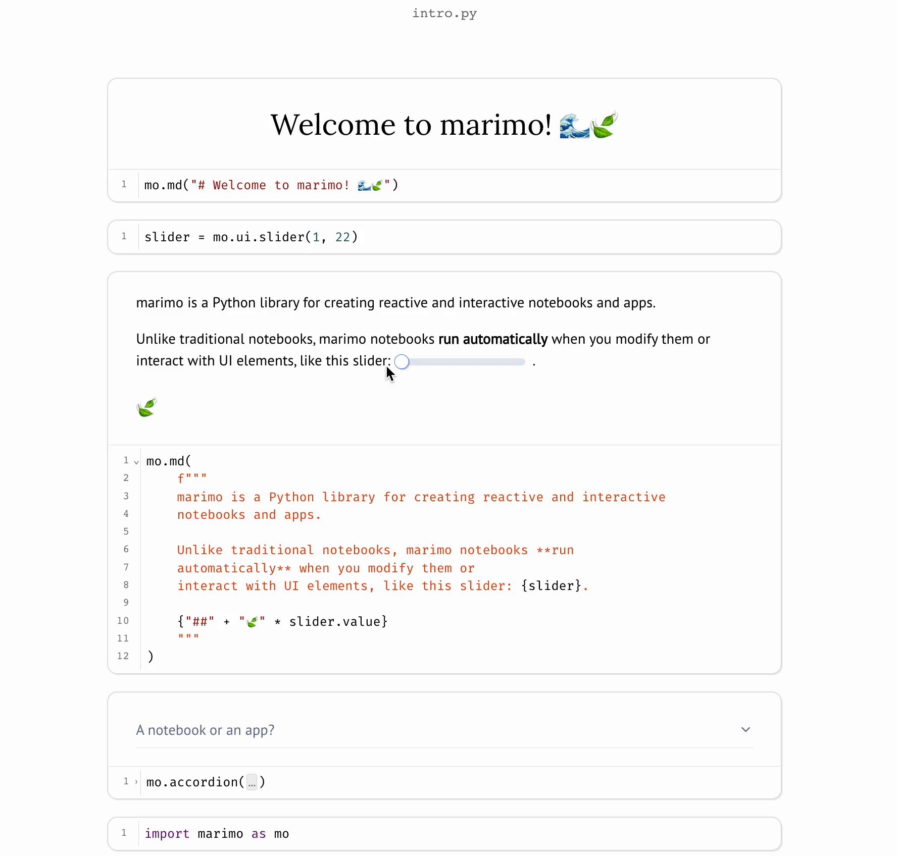
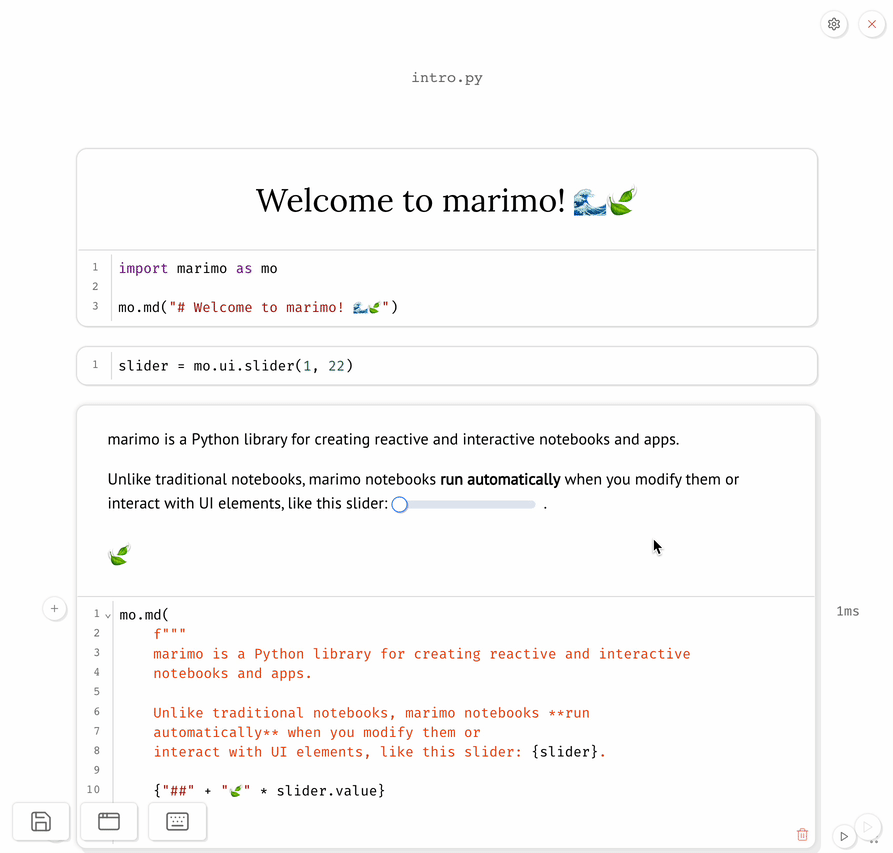
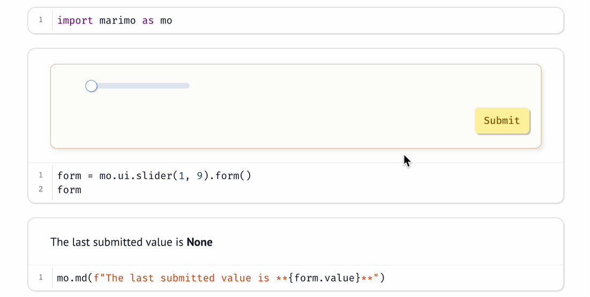
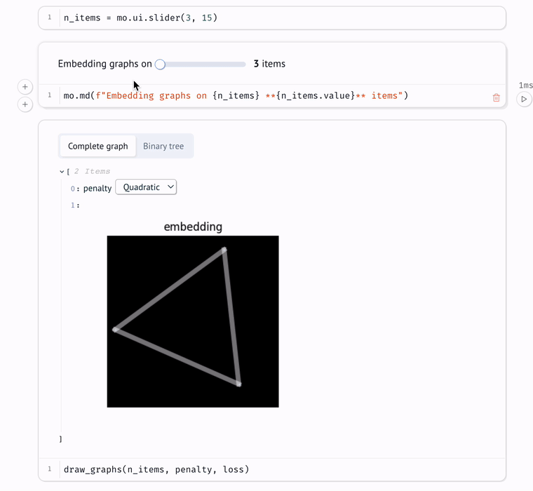

<p align="center">
  
</p>

<p align="center">
  Next-generation Python notebooks and apps.

<p align="center">
  <a href="https://docs.marimo.io" target="_blank"><strong>Docs</strong></a> ·
  <a href="https://discord.gg/JE7nhX6mD8" target="_blank"><strong>Discord</strong></a> ·
  <a href="https://marimo.io/examples" target="_blank"><strong>Examples</strong></a>
</p>

**marimo** is a Python library for creating **reactive notebooks
that double as apps**. marimo is:

- **reactive**: run a cell and marimo automatically runs cells that depend on it
- **interactive**: interact with sliders, dropdowns, tables, and more to
  automatically run dependent cells
- **expressive**: parametrize markdown with interactive elements, plots, or anything else
- **simple**: no callbacks, no magical syntax
- **Pythonic**: cells only run Python; notebooks stored as `.py` files (clean git diffs!)
- **performant**: powered by static analysis, zero runtime overhead

marimo was built from the ground up to solve many [well-known problems
with traditional notebooks](#faq-jupyter). marimo is _not_ built on top of
Jupyter or any other notebook or app library.



**Contents.**

<!-- toc -->

- [Getting Started](#getting-started)
  - [Installation](#installation)
  - [Tutorials](#tutorials)
  - [Notebooks](#notebooks)
  - [Apps](#apps)
  - [Convert Jupyter notebooks](#convert-jupyter-notebooks)
- [Concepts](#concepts)
- [Examples](#examples)
- [FAQ](#faq)
- [Contributing](#contributing)
- [License](#license)
- [Community](#community)

<!-- tocstop -->

## Getting Started

Installing marimo gets you the `marimo` command-line interface (CLI), the 
entry point to all things marimo.

### Installation

In a terminal, run

```bash
pip install marimo
marimo tutorial intro
```

You should see a tutorial notebook in your browser:

<div align="center">

</div>

If that doesn't work, please [open a Github issue](https://github.com/marimo-team/marimo/issues).

### Tutorials

`marimo tutorial intro` opens the intro tutorial. List all tutorials with

```bash
marimo tutorial --help
```

### Notebooks

Create and edit notebooks with `marimo edit`.

- create a new notebook:

```bash
marimo edit
```

- create or edit a notebook with a given name:

```bash
marimo edit your_notebook.py
```

### Apps

Use `marimo run` to serve your notebook as an app, with Python code hidden and
uneditable.

```bash
marimo run your_notebook.py
```

### Convert Jupyter notebooks

Automatically translate Jupyter notebooks to marimo notebooks with `marimo convert`:

```bash
marimo convert your_notebook.ipynb > your_notebook.py
```

Because marimo is different from traditional notebooks, your converted
notebook will likely have errors that you'll need to fix. marimo
will guide you through fixing them when you open it with `marimo edit`.

## Concepts

marimo notebooks are **reactive**: they automatically react to your code
changes and UI interactions and keep your notebook up-to-date (like a
spreadsheet).

### Cells

A marimo notebook is made of small blocks of Python code called **cells**.
_When you run a cell, marimo automatically runs all cells that read any global
variables defined by that cell._ This is reactive execution.

> **Reactive execution lets your notebooks double as interactive
apps**. It also guarantees that your code and program state are
consistent.

<div align="center">
<figure>

</figure>
</div>

**Execution order.**
The order of cells on the page has no bearing on the order cells are
executed in: execution order is completely determined by the variables
cells define and the cells they read. You have full freedom over
how to organize your code and tell your stories: move helper functions and
other "appendices" to the bottom of your notebook, or put cells with important
outputs at the top.

**No hidden state.**
marimo notebooks have no hidden state because the program state is
automatically synchronized with your code changes and UI interactions. And if
you delete a cell, marimo automatically deletes that cell's variables,
preventing painful bugs that arise in traditional notebooks.

**No magical syntax.**
There's no magical syntax or API required to opt-in to reactivity: cells are
Python and _only Python_. Behind-the-scenes, marimo statically analyzes each
cell's code just once, creating a directed acyclic graph based on the
global names each cell defines and reads. This is how data flows
in a marimo notebook.


For more on reactive execution, open the dataflow tutorial:

```bash
marimo tutorial dataflow
```

### The marimo library

marimo is both a notebook and a library. The marimo library lets you use
markdown, interactive UI elements, layout elements, and more in your marimo
notebooks.

We recommend starting each marimo notebook with a cell containing a single
line of code,


```python3
import marimo as mo
```

### Outputs

marimo visualizes the last expression of each cell as its **output**. Outputs
can be any Python value, including markdown and interactive elements created
with the marimo library, _e.g._, `mo.md(...)`, `mo.ui.slider(...)`.
You can even interpolate Python values into markdown and other marimo elements
to build rich composite outputs.

<div align="center">
<figure>

</figure>
</div>

> Thanks to reactive execution, running a
cell refreshes all the relevant outputs in your notebook.

For more on outputs, try these tutorials:

```bash
marimo tutorial markdown
marimo tutorial plots
marimo tutorial layout
```


### Interactive elements

The marimo library comes with many interactive stateful elements in
`marimo.ui`, including simple ones like sliders, dropdowns, text fields, and file
upload areas, as well as composite ones like forms, arrays, and dictionaries
that can wrap other UI elements.

<div align="center">
<figure>

</figure>
</div>

**Using UI elements.**
To use a UI element, create it with `marimo.ui` and **assign it to a global
variable.** When you interact with a UI element in your browser (_e.g._,
sliding a slider), _marimo sends the new value back to Python and reactively
runs all cells that use the element_, which you can access via its `value`
attribute.

> **This combination of interactivity and reactivity is very powerful**: use it
to make your data tangible during exploration and to build all kinds of tools
and apps.

 _marimo can only synchronize UI elements that are assigned to
global variables._ You can use composite elements like `mo.ui.array` and
`mo.ui.dictionary` if the set of UI elements is not known until runtime.

For more on interactive elements, run the UI tutorial:

```bash
marimo tutorial ui
```

#### Composite elements

marimo's composite UI elements let you wrap other UI
elements to create powerful UIs. For example,
`marimo.ui.form` lets you gate elements on submission, while
`marimo.ui.dictionary` and `marimo.ui.array` let you batch arbitrary
collections of elements.

<div align="center">
<figure>

</figure>
</div>


### Layout

The marimo library also comes with layout elements, including `mo.hstack`,
`mo.vstack`, `mo.tabs`, and more.

## Examples

Examples are available in the `examples/` directory. Community examples can be
found and shared in the [marimo cookbook](https://github.com/marimo-team/cookbook).

## FAQ

- [Choosing marimo](#choosing-marimo)
  - [How is marimo different from Jupyter?](#faq-jupyter)
  - [How is marimo.ui different from Jupyter widgets?](#faq-widgets)
- [Using marimo](#using-marimo)
  - [Is marimo a notebook or a library?](#faq-notebook-or-library)
  - [How does marimo know what cells to run?](#faq-reactivity)
  - [How do I use sliders and other interactive elements?](#faq-interactivity)
  - [How do I add a submit button to UI elements?](#faq-form)
  - [How do I write markdown?](#faq-markdown)
  - [How do I display plots?](#faq-plots)
  - [How do I display objects in rows and columns?](#faq-rows-columns)
  - [What packages can I use?](#faq-packages)
  - [What's the difference between a marimo notebook and a marimo app?](#faq-notebook-app)
  - [How do I deploy apps?](#faq-app-deploy)
  - [Is marimo free?](#faq-marimo-free)

<!--With interactivity and reactivity, marimo enables rapid data exploration and
and makes it seamless to turn notebooks into powerful apps for yourself and
others. marimo also solves many well-documented problems associated with
traditional notebooks by eliminating the problem of inconsistent state, making
your notebooks more reproducible and saving you from costly bugs. -->

### Choosing marimo

<a name="faq-jupyter" ></a>
**How is marimo different from Jupyter?**

marimo is a brand new Python notebook that is both _interactive_, with 
UI elements like sliders, dropdowns, etc., and _reactive_, like a
spreadsheet. marimo solves many well-documented problems associated with
traditional notebooks like Jupyter
[[1]](https://austinhenley.com/pubs/Chattopadhyay2020CHI_NotebookPainpoints.pdf)
[[2]](https://docs.google.com/presentation/d/1n2RlMdmv1p25Xy5thJUhkKGvjtV-dkAIsUXP-AL4ffI/edit#slide=id.g362da58057_0_1):

- **no hidden state**: running a cell automatically runs all
  cells that depend on it, and deleting a cell automatically deletes its
variables, eliminating hidden state and hidden bugs
- **interactive data exploration**: UI elements and reactivity make your data
  tangible
- **sharing**: use the marimo CLI to run notebooks as apps
- **Python, not JSON**: stored as executable Python, with clean git diffs
  and potential for code reuse
- **fast, reliable autocomplete**: code completion is fast and works out of the
  box


<a name="faq-widgets" ></a>
**How is `marimo.ui` different from Jupyter widgets?**


Unlike Jupyter widgets, marimo's interactive elements are automatically
synchronized with the Python kernel: no callbacks, no observers, no manually
re-running cells.


<p align="center">

</p>

### Using marimo

**Is marimo a notebook or a library?**

marimo is both a notebook and a library.

- Create _marimo notebooks_ with the editor that opens in your
  browser when you run `marimo edit`.
- Use the _marimo library_ (`import marimo as mo`) in
  marimo notebooks. Write markdown with `mo.md(...)`,
  create stateful interactive elements with `mo.ui` (`mo.ui.slider(...)`), and
  more. See the docs for an [API reference](https://docs.marimo.io/api/).

<a name="faq-reactivity" ></a>
**How does marimo know what cells to run?**

marimo reads each cell once to determine what global names it defines and what
global names it reads. When a cell is run, marimo runs all other cells that
read any of the global names it defines. A global name can refer to a variable,
class, function, or import. 

In other words, marimo uses _static analysis_ to make a dataflow graph out of
your cells. Each cell is a node in the graph across which global
variables "flow". Whenever a cell is run, either because you changed its
code or interacted with a UI element it reads, all its descendants run in turn.

<a name="faq-interactivity" ></a>
**How do I use sliders and other interactive elements?**

Interactive UI elements like sliders are available in `marimo.ui`.

- Assign the UI element to a global variable (`slider = mo.ui.slider(0,
  100)`)
- Include it in the last expression of a cell to display
it (`slider` or `mo.md(f"Choose a value: {slider}")`)
- Read its current value in another cell via its `value` attribute (`slider.value`)

If you have many UI elements or don't know the elements
you'll create until runtime, use `marimo.ui.array` and `marimo.ui.dictionary`
to create UI elements that wrap other UI elements (`sliders =
mo.ui.array([slider(1, 100) for _ in range(n_sliders)])`).

All this and more is explained in the UI tutorial. Run it with

```bash
marimo tutorial ui
```

at the command line.

<a name="faq-form" ></a>
**How do I add a submit button to UI elements?**

Use the `form` method to add a submit button to a UI element. For
example,

```python
form = marimo.ui.text_area().form()
```
 When wrapped in a form, the
text area's value will only be sent to Python when you click the submit button.
Access the last submitted value of the text area with `form.value`.

<a name="faq-markdown" ></a>
**How do I write markdown?**

Import `marimo` (as `mo`) in a notebook, and use the `mo.md` function.


<a name="faq-plots" ></a>
**How do I display plots?**

Include plots in the last expression of a cell to display them, just like all
other outputs. If you're using matplotlib, you can display the `Figure` object
(get the current figure with `plt.gcf()`). For examples, run the plots tutorial:

```bash
marimo tutorial plots
```

<a name="faq-rows-columns" ></a>
**How do I display objects in rows and columns?**

Use `marimo.hstack` and `marimo.vstack`. See the layout tutorial for details:

```bash
marimo tutorial layout
```
<a name="faq-packages" ></a>
**What packages can I use?**

You can use any Python package. marimo cells run arbitrary Python code.

<a name="faq-notebook-app" ></a>
**What's the difference between a marimo notebook and a marimo app?**

You can think of marimo programs as notebooks, apps, or both. Edit a marimo
program as notebook with `marimo edit`, or run it as an app, rendering cell
outputs without their code, with `marimo run`.

<a name="faq-app-deploy" ></a>
**How do I deploy apps?**

Use the marimo CLI's `run` command to serve a notebook as an app:

```
marimo run notebook.py
```

<a name="faq-marimo-free" ></a>
**Is marimo free?**

Yes!

## Contributing

We appreciate all contributions. You don't need to be an expert to help out.
Please see [CONTRIBUTING.md](CONTRIBUTING.md) for more details on how to get
started.

> Questions? Reach out to us [on Discord](https://discord.gg/JE7nhX6mD8).

## Community

We're building a community [on Discord](https://discord.gg/JE7nhX6mD8). Come
hang out with us!
