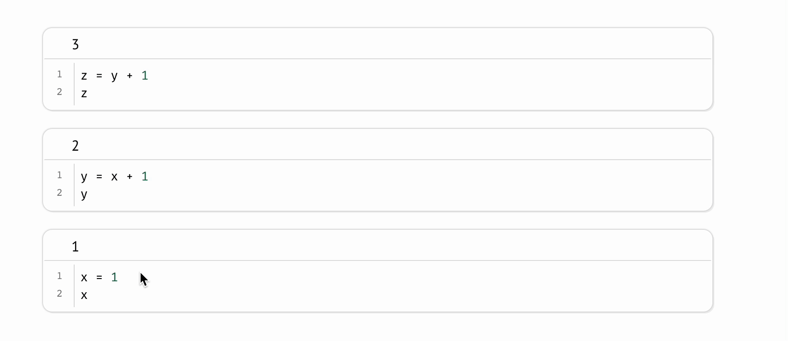
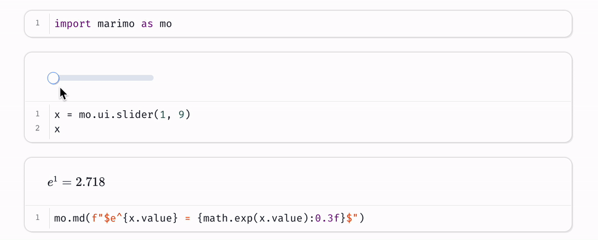
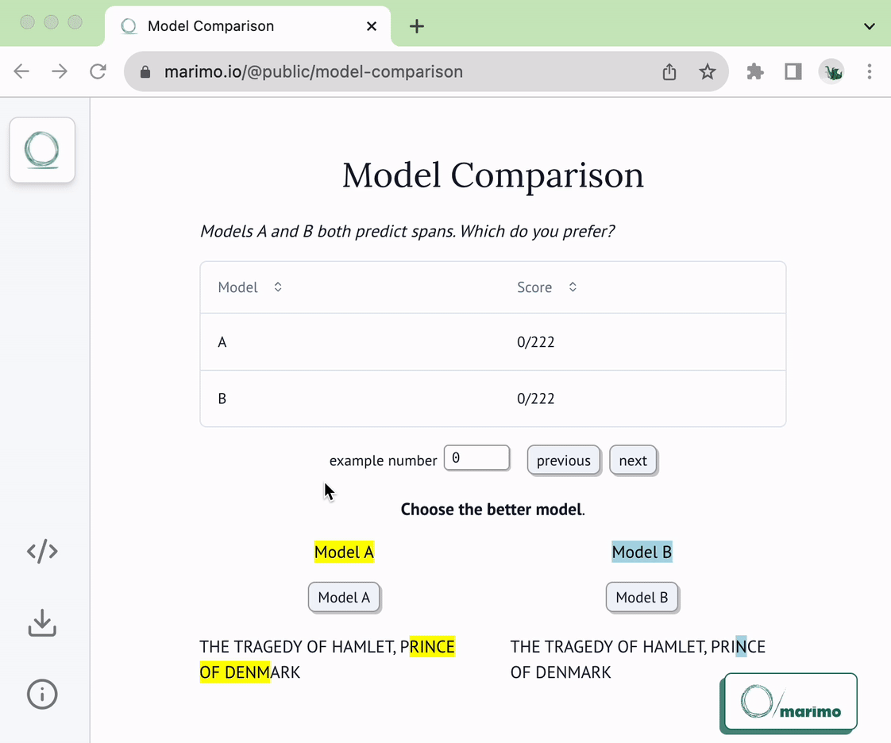

<p align="center">
  
</p>

<p align="center">
  <em>A reactive Python notebook that's reproducible, git-friendly, and deployable as scripts or apps.</em>

<p align="center">
  <a href="https://docs.marimo.io" target="_blank"><strong>Docs</strong></a> ·
  <a href="https://discord.gg/JE7nhX6mD8" target="_blank"><strong>Discord</strong></a> ·
  <a href="https://github.com/marimo-team/marimo/tree/main/examples" target="_blank"><strong>Examples</strong></a>
</p>

<p align="center">
<a href="https://pypi.org/project/marimo/"></a>
<a href="https://anaconda.org/conda-forge/marimo"></a>
<a href="https://github.com/marimo-team/marimo/blob/main/LICENSE"></a>
</p>

marimo is a reactive notebook for Python. It allows you to rapidly experiment
with data and models, code with confidence in your notebook's correctness, and
productionize notebooks as pipelines or interactive web apps.


**Highlights**.

- **reactive**: run a cell, and marimo automatically updates all affected cells and outputs
- **interactive**: bind sliders, tables, plots, and more to Python — no callbacks required
- **reproducible**: no hidden state, deterministic execution order
- **executable**: execute as a Python script
- **shareable**: deploy as an app
- **git-friendly**: stored as `.py` files


```python
pip install marimo && marimo tutorial intro
```

_Jump to the [quickstart](#quickstart) for a primer on our CLI._

## A reactive programming environment

marimo guarantees your notebook code, outputs, and program state are consistent. This [solves many problems](https://docs.marimo.io/faq.html#faq-problems) associated with traditional notebooks like Jupyter.

**A reactive programming environment.**
Run a cell and marimo _reacts_ by automatically running the cells that
reference its variables, eliminating the error-prone task of manually
re-running cells. Delete a cell and marimo scrubs its variables from program
memory, eliminating hidden state.



**Deterministic execution order.** Notebooks are executed in a deterministic
order, based on variable references instead of cells' positions on the page.
Organize your notebooks to best fit the stories you'd like to tell.

**Synchronized UI elements.** Interact with UI elements like sliders,
dropdowns, and dataframe transformers, and the cells that use them are
automatically re-run with their latest values.



**Performant runtime.** marimo runs only those cells that need to be run by
statically analyzing your code. You can optionally disable expensive cells to
prevent them from automatically running.

**Batteries-included.** marimo comes with GitHub Copilot, Black code
formatting, HTML export, fast code completion, a [VS Code
extension](https://marketplace.visualstudio.com/items?itemName=marimo-team.vscode-marimo),
and many more quality-of-life features.

## Quickstart

**Installation.** In a terminal, run

```bash
pip install marimo  # or conda install -c conda-forge marimo
marimo tutorial intro
```

**Create notebooks.**
Create an empty notebook with

```bash
marimo edit
```

or create/edit a notebook with a given name with

```bash
marimo edit your_notebook.py
```


**Run apps.** Run your notebook as a web app, with Python
code hidden and
uneditable:

```bash
marimo run your_notebook.py
```



**Execute as scripts.** marimo notebooks can be executed as scripts at the
command line:

```bash
python your_notebook.py
```

**Automatically convert Jupyter notebooks.** Automatically convert Jupyter notebooks to marimo notebooks with the CLI

```bash
marimo convert your_notebook.ipynb > your_notebook.py
```

or use our [web interface](https://marimo.io/convert).

**Tutorials.**
List all tutorials:

```bash
marimo tutorial --help
```

## Questions?

See the [FAQ](https://docs.marimo.io/faq.html) at our docs.


## Learn more

marimo is easy to get started with, with lots of room for power users.
For example, here's an embedding visualizer made in marimo
([video](https://marimo.io/videos/landing/full.mp4)):


Check out our [docs](https://docs.marimo.io),
the `examples/` folder, and our [gallery](https://marimo.io/@public) to learn more.

<table border="0">
  <tr>
    <td>
      <a target="_blank" href="https://docs.marimo.io/guides/overview.html">
        
      </a>
    </td>
    <td>
      <a target="_blank" href="https://docs.marimo.io/api/inputs/index.html">
        
      </a>
    </td>
    <td>
      <a target="_blank" href="https://docs.marimo.io/guides/plotting.html">
        
      </a>
    </td>
    <td>
      <a target="_blank" href="https://docs.marimo.io/api/layouts/index.html">
        
      </a>
    </td>
    </tr>
  <tr>
    <td>
      <a target="_blank" href="https://docs.marimo.io/guides/overview.html">
	  Tutorial
	  </a>
	</td>
    <td>
      <a target="_blank" href="https://docs.marimo.io/api/inputs/index.html">
	  Inputs
	  </a>
	</td>
    <td>
      <a target="_blank" href="https://docs.marimo.io/guides/plotting.html">
	  Plots
	  </a>
	</td>
    <td>
      <a target="_blank" href="https://docs.marimo.io/api/layouts/index.html">
	  Layout
	  </a>
	</td>
  </tr>
</table>

## Contributing

We appreciate all contributions! You don't need to be an expert to help out.
Please see [CONTRIBUTING.md](CONTRIBUTING.md) for more details on how to get
started.

> Questions? Reach out to us [on Discord](https://discord.gg/JE7nhX6mD8).

## Community

We're building a community. Come hang out with us!

- 🌟 [Star us on GitHub](https://github.com/marimo-team/marimo)
- 💬 [Chat with us on Discord](https://discord.gg/JE7nhX6mD8)
- 📧 [Subscribe to our Newsletter](https://marimo.io/newsletter)
- ☁️  [Join our Cloud Waitlist](https://marimo.io/cloud)
- ✏️  [Start a GitHub Discussion](https://github.com/marimo-team/marimo/discussions)
- 🐦 [Follow us on Twitter](https://twitter.com/marimo_io)
- 🕴️ [Follow us on LinkedIn](https://www.linkedin.com/company/marimo-io)

## Inspiration ✨

marimo is a **reinvention** of the Python notebook as a reproducible, interactive,
and shareable Python program, instead of an error-prone JSON scratchpad.

We believe that the tools we use shape the way we think — better tools, for
better minds. With marimo, we hope to provide the Python community with a
better programming environment to do research and communicate it; to experiment
with code and share it; to learn computational science and teach it.

Our inspiration comes from many places and projects, especially
[Pluto.jl](https://github.com/fonsp/Pluto.jl),
[ObservableHQ](https://observablehq.com/tutorials), and
[Bret Victor's essays](http://worrydream.com/). marimo is part of
a greater movement toward reactive dataflow programming. From
[IPyflow](https://github.com/ipyflow/ipyflow), [streamlit](https://github.com/streamlit/streamlit),
[TensorFlow](https://github.com/tensorflow/tensorflow),
[PyTorch](https://github.com/pytorch/pytorch/tree/main),
[JAX](https://github.com/google/jax), and
[React](https://github.com/facebook/react), the ideas of functional,
declarative, and reactive programming are transforming a broad range of tools
for the better.

<p align="right">
  
</p>
