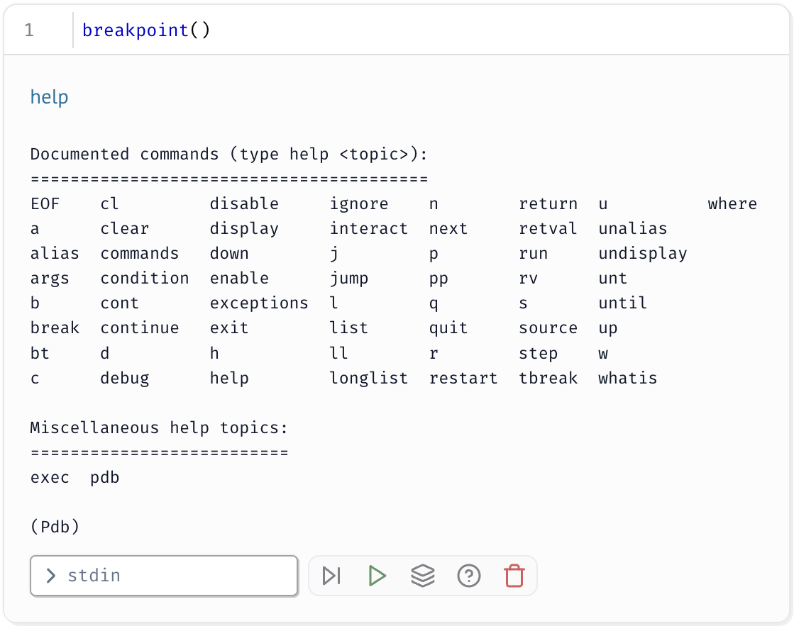
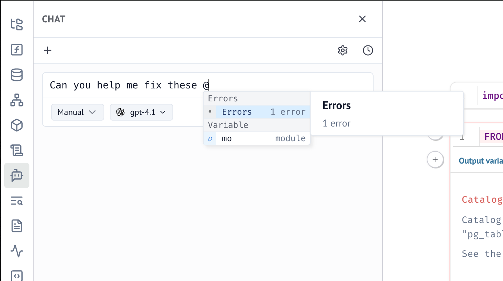

# Debugging marimo Notebooks

## Debugging in marimo

### Using pdb in marimo Notebooks

marimo has direct support for pdb, the Python debugger. You can set breakpoints
in your code using the built-in `breakpoint()` function. When the code
execution reaches a breakpoint, it will pause, and you can inspect variables,
step through the code, and evaluate expressions.

Here's an example of how to use `breakpoint()` in a marimo notebook cell.



Type `help` in the debugger for a list of commands:

```txt
Documented commands (type help <topic>):
========================================
EOF    cl         disable     ignore    n        return  u          where
a      clear      display     interact  next     retval  unalias
alias  commands   down        j         p        run     undisplay
args   condition  enable      jump      pp       rv      unt
b      cont       exceptions  l         q        s       until
break  continue   exit        list      quit     source  up
bt     d          h           ll        r        step    w
c      debug      help        longlist  restart  tbreak  whatis

Miscellaneous help topics:
==========================
exec  pdb
```

!!! note
    Since this block is runnable, you can test the debugger directly

/// marimo-embed

```python
@app.cell
def __():
    # Compute triangle numbers
    triangle = 0
    triangle_count = 20
    for i in range(1, triangle_count):
        triangle += i # T_i = sum of 1..i
        # Debug at the 10th iteration
        # as a sanity check. Should be 55.
        if i == 10:
            breakpoint()
    return
```

///

!!! tip
    Click the little bug icon in the stack trace to add breakpoints.
    <video autoplay muted loop playsinline width="100%" align="center" src="../_static/pdb_breakpoint_in_marimo.webm" alt="Animation showing how to click the bug icon to add PDB breakpoints">
    </video>
    Clicking on the cell link will also take you to the cell where the error occurred.

### Postmortem Debugging

If your code raises an exception, you can use postmortem debugging to inspect
the state of the program at the point where the exception occurred. Click on
the "Launch debugger" button as shown below:

<video autoplay muted loop playsinline width="100%" align="center" src="../_static/postmortem_debugging_in_marimo.webm" alt="Video demonstrating postmortem debugging with the Launch debugger button">
</video>


!!! note
    Other tools like the following will also work in marimo notebooks:

    ```python
      import code
      code.interact()
      return
    ```

!!! danger
    Remember to continue or quit the debugger to avoid hanging the notebook!

## Tips for debugging marimo notebooks with AI

marimo provides built-in integration with AI assistants to help debug your notebooks more effectively.

### Using the Notebook Errors context

When errors occur in your notebook, marimo captures them in a **"Notebook
Errors" context** that can be shared with AI assistants. This feature
automatically collects comprehensive error information from your notebook,
making it easier to get targeted debugging help.



### Best practices for AI-assisted debugging

**Provide context beyond just the error.** Include information about:
- What you were trying to accomplish
- Recent changes you made to the notebook
- Whether the error is new or recurring
- Related cells that might be involved

**Leverage marimo's debugging tools alongside AI.** Use marimo's [dataflow
tools](../guides/troubleshooting.md#verify-cell-connections) to understand cell
relationships, then share this information with AI assistants for more targeted
advice.

**Ask specific questions.** Instead of "Why is this broken?", try:
- "Why might this reactivity issue be occurring between these cells?"
- "How can I fix this import error in my marimo notebook?"
- "What's the best way to debug this performance issue in my data processing pipeline?"

!!! tip
    AI assistants are particularly helpful for explaining marimo-specific
    concepts like reactive execution, cell dependencies, and the differences
    between marimo notebooks and traditional Jupyter notebooks.

## marimo as a Script
Since marimo notebooks are standard Python files, you can run them as scripts
from the command line. The following command will run your marimo notebook and
drop you into the pdb debugger if an exception occurs, or if you hit a
breakpoint.

```bash
python -m pdb your_script.py
```

## Debugpy

### Debugpy script mode
Likewise, using debugpy directly in marimo notebooks is supported.
If you want to use VSCode's debugging features, the following `launch.json`
will debug a marimo notebook in [script mode](link-to-script-mode).

```json
{
  "version": "0.2.0",
  "configurations": [
    {
      "type": "python",
      "request": "launch",
      "name": "marimo Debug: script mode",
      "program": "${file}",
      "debugOptions": [
          "--ignore", "*/site-packages/marimo/*"
      ]
    },
  ]
}
```

### Debugpy edit mode
Partial support for edit mode debugging is also available.
This mode allows the marimo editor to hit breakpoints set in an IDE like VSCode.

<video autoplay muted loop playsinline width="100%" align="center" src="../_static/debugpy_edit_mode_in_marimo.webm" alt="Video showing debugpy edit mode debugging with VSCode hitting marimo breakpoints">
</video>

Note, this will disable marimo's internal debugging features.

!!! danger
    This mode is blocking in VSCode, so you will need to interact with the
    debugger in your editor to regain control of the marimo notebook.

Use the following `launch.json` configuration to enable edit mode debugging:

```json
{
  "version": "0.2.0",
  "configurations": [
    {
        "type": "debugpy",
        "request": "launch",
        "name": "marimo Debug: edit mode",
        "program": "${file}",
        "console": "integratedTerminal",
        "cwd": "${workspaceFolder}",
        "env": {
            "MARIMO_SCRIPT_EDIT": "1"
        },
        "justMyCode": false
    }
  ]
}
```

## Coming soon

LSP support for marimo notebooks is coming soon, and a native debug server
integration should be available in the near future.
