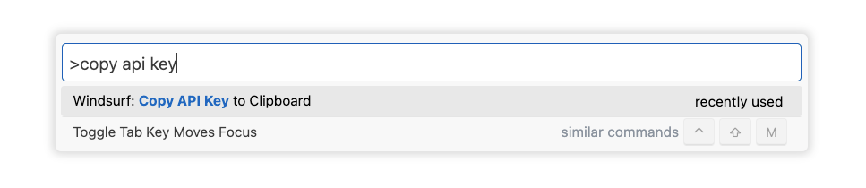

# AI-assisted coding

marimo is an AI-native editor, with support for full-cell AI code generation:

* generating new cells from a prompt
* refactoring existing cells from a prompt
* generating entire notebooks

as well as inline autocompletion (like GitHub Copilot).

marimo's AI assistant is specialized for working with data: unlike traditional
assistants that only have access to the text of your program, marimo's assistant
has access to the values of variables in memory, letting it code against
your dataframe and database schemas.

This guide provides an overview of these features and how to configure them.

!!! tip "Locating your marimo.toml config file"

    Various instructions in this guide refer to the marimo.toml configuration
    file. Locate this file with `marimo config show | head`.

## Generating cells with AI

<video autoplay muted loop playsinline width="100%" height="100%" align="center">
  <source src="/_static/readme-generate-with-ai.mp4" type="video/mp4">
</video>

marimo has built-in support for generating and refactoring code with LLMs.
marimo works with hosted AI providers, such as OpenAI, Anthropic, and Google,
as well as local models served via Ollama.

**Enabling AI code generation.** To enable AI code generation, first install
required dependencies through the notebook settings.

<div align="center">
<figure>

<figcaption>Install required dependencies for AI generation through the notebook settings.</figcaption>
</figure>
</div>

Then configure your LLM provider through the AI tab in the settings menu; see
the section on [connecting your LLM](#connecting-to-an-llm) for detailed instructions.

### Variable context

marimo's AI assistant has your notebook code as context. You can additionally
pass variables and their values to the assistant by referencing them by name
with `@`. For example, to include the columns of a dataframe `df` in your
prompt, write `@df`.

<div align="center">
<figure>

<figcaption>Pass variables to your prompt by tagging them with `@`.</figcaption>
</figure>
</div>

### Refactor existing cells

Make edits to an existing cell by hitting `Ctrl/Cmd-shift-e`, which opens a prompt box
that has your cell's code as input.

<div align="center">
<figure>
<video src="/_static/ai-completion.mp4" controls="controls" width="100%" height="100%"></video>
<figcaption>Use AI to modify a cell by pressing `Ctrl/Cmd-Shift-e`.</figcaption>
</figure>
</div>

### Generate new cells

#### Generate with AI button

At the bottom of every notebook is a button titled "Generate with AI". Click this
button to add entirely new cells to your notebook.

#### Chat panel

The chat panel on the left sidebar lets you chat with an LLM and ask questions
aboutyour notebook. The LLM can also generate code cells that you can insert
into your notebook.

The chat panel currently supports the following modes:

- **Ask**: Enables read-only [AI tools](tools.md) and [tools from added MCP Client servers](mcp.md#mcp-client) for context gathering, allowing the assistant to inspect your notebooks
- **Manual**: No tool access; the AI responds based only on the conversation and manually injected context

??? tip "See the chat panel in action"

    <iframe width="740" height="420" src="https://www.youtube.com/embed/4DC1E2UBwAM?si=zzrzl0VlvOU6JiZP" title="YouTube video player" frameborder="0" allow="accelerometer; autoplay; clipboard-write; encrypted-media; gyroscope; picture-in-picture; web-share" referrerpolicy="strict-origin-when-cross-origin" allowfullscreen></iframe>

### Generating entire notebooks

Generate entire notebooks with `marimo new PROMPT` at the command-line; see the
[text-to-notebook docs](../generate_with_ai/text_to_notebook.md) to learn more.

### Custom rules

You can customize how the AI assistant behaves by adding rules in the marimo settings. These rules help ensure consistent code generation across all AI providers. You can find more information about marimo's supported plotting libraries and data handling in the [plotting guide](../working_with_data/plotting.md#plotting) and [working with data guide](../working_with_data/index.md).

<div align="center">
  <figure>
    
    <figcaption>Configure custom AI rules in settings</figcaption>
  </figure>
</div>

For example, you can add rules about:

* Preferred plotting libraries (matplotlib, plotly, altair)
* Data handling practices
* Code style conventions
* Error handling preferences

Example custom rules:

```
Use plotly for interactive visualizations and matplotlib for static plots
Prefer polars over pandas for data manipulation due to better performance
Include docstrings for all functions using NumPy style
Use Type hints for all function parameters and return values
Handle errors with try/except blocks and provide informative error messages
Follow PEP 8 style guidelines
When working with data:
- Use altair, plotly for declarative visualizations
- Prefer polars over pandas
- Ensure proper error handling for data operations
For plotting:
- Use px.scatter for scatter plots
- Use px.line for time series
- Include proper axis labels and titles
- Set appropriate color schemes
```

### Connecting to an LLM

You can connect to an LLM through the notebook settings menu, or by manually editing
your `marimo.toml` configuration file. **Prefer going through the notebook settings menu.**

You can configure the following providers:

* OpenAI
* Anthropic
* AWS Bedrock
* Google AI
* GitHub
* Ollama
* and any OpenAI-compatible provider

See the [llm_providers](../configuration/llm_providers.md) guide for detailed instructions on how to configure each provider.

## Agents

!!! example "Experimental: Agents"

    marimo also supports external AI agents like Claude Code and Gemini CLI that can interact with your notebooks.
    Learn more in the [agents](agents.md) guide.

## Copilots

Copilots allow you to tab-complete code based on your notebook's context, similar to editors like Cursor. 

<video autoplay muted loop playsinline width="100%" height="100%" align="center">
  <source src="/_static/docs-ai-completion-preview.mp4" type="video/mp4">
</video>

### GitHub Copilot

The marimo editor natively supports [GitHub Copilot](https://copilot.github.com/),
an AI pair programmer, similar to VS Code:

1. Install [Node.js](https://nodejs.org/en/download).
2. Enable Copilot via the settings menu in the marimo editor.

<div align="center">
<figure>

<figcaption>Enable GitHub Copilot in the settings menu.</figcaption>
</figure>
</div>

_GitHUb Copilot is not yet available in our conda distribution; please install
marimo using `pip`/`uv` if you need Copilot._

### Windsurf Copilot

[Windsurf](https://windsurf.com/) (formerly codeium) provides tab-completion tooling that can also be used from within marimo.

To set up Windsurf:

1. Go to [windsurf.com](https://windsurf.com/) website and sign up for an account.
2. Download the [Windsurf app](https://windsurf.com/download).
3. After installing Windsurf and authenticating, open up the command palette, via <kbd>cmd</kbd>+<kbd>shift</kbd>+<kbd>p</kbd>, and ask it to copy the api key to your clipboard.



4a. Configure the UI settings in the editor to use Windsurf.


4b. Alternatively you can also configure the api key from the marimo config file.

```toml title="marimo.toml"
[completion]
copilot = "codeium"
codeium_api_key = ""
```

### Custom copilots

marimo also supports integrating with custom LLM providers for code completion suggestions. This allows you to use your own LLM service to provide in-line code suggestions based on internal providers or local models (e.g. Ollama). You may also use OpenAI, Anthropic, Google, or any other providers by providing your own API keys and configuration.

To configure a custom copilot:

1. Ensure you have an LLM provider that offers API access for code completion (either external or running locally)
2. Add the following configuration to your `marimo.toml` (or configure in the UI settings in the editor):

```toml title="marimo.toml"
[ai.models]
autocomplete_model = "provider/model-name"

[completion]
copilot = "custom"
```

The configuration options include:

* `autocomplete_model`: The specific model to use for inline autocompletion.
* `copilot`: The name of the copilot to use for code generation.
