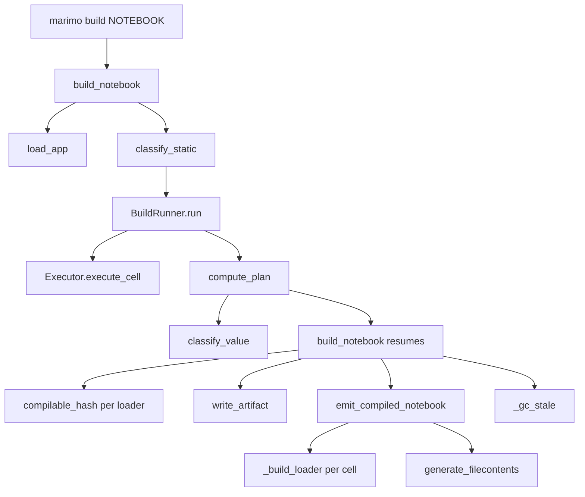

# `marimo build` — implementation handoff

This document is for the next agent picking up work on `marimo build`.
It is intentionally **not** in the public docs nav; it captures the
interior of the feature, not the user-facing surface.

## What was built

A new top-level CLI command `marimo build NOTEBOOK` plus its supporting
package `marimo/_build/`. The command pre-executes the input-free
slice of a notebook's DAG, persists each named/consumed cell's defined
value to disk (parquet for dataframes, JSON otherwise), and emits a
compiled copy of the notebook in which those cells become tiny
artifact-loader cells. Anonymous compilable cells whose defs aren't
needed by anyone are elided. Runs are incremental via Merkle hashing
over the compilable subgraph; stale artifacts are GC'd after every
successful build.

The CLI surface is one new command, defined in
`marimo/_cli/cli.py` next to `recover` / `check`. Directory scanning
in the same file now skips `__marimo_build__` alongside `__marimo__`.

## Pipeline

`build_notebook` is six small phases:

1. **Static classification** (`classify.py`). Partition cells into
   `compilable` and `non_compilable` from the AST. A cell is
   non-compilable iff it directly references `<mo>.ui.*` /
   `<mo>.cli_args` or has any non-compilable parent.
2. **Execution** (`runner.py`). Run every statically compilable cell
   in topological order. Capture each cell's defined globals.
3. **Planning** (`plan.py`). Decide a `CellKind` for every cell:
   `SETUP`, `LOADER`, `ELIDED`, or `VERBATIM`.
4. **Persistence** (`build.py` + `serialize.py`). For every `LOADER`
   cell, hash its compilable subgraph, name the artifact files, and
   write parquet/JSON to disk (skipping if already present, unless
   `--force`).
5. **Codegen** (`codegen.py`). Emit the compiled `.py` file using the
   plan and the artifact filenames.
6. **GC** (`build.py`). Delete any top-level `*.parquet`/`*.json` left
   over from previous runs that aren't in this run's manifest.

## The inductive rule

Every non-setup cell ends up in exactly one of `LOADER`, `ELIDED`, or
`VERBATIM`. The setup cell is always `SETUP`.

```text
static_compilable(c)  ⟺ ¬directly_uses_input(c)
                         ∧ ∀ p ∈ parents(c): static_compilable(p)
runtime_compilable(c) ⟺ has_defs(c) ∧ ∀ d ∈ c.defs: persistable(d)
compilable(c)         ⟺ static_compilable(c) ∧ runtime_compilable(c)

named(c) ⟺ c.fn_name does not start with "_"
retained_consumer(c) ⟺ c.defs ∩ retained_refs ≠ ∅
retained_refs        = ⋃ { d.refs : kind(d) ∈ {SETUP, VERBATIM} }

kind(c) =
    SETUP                     if c is the setup cell
    LOADER                    if compilable(c) ∧ (named(c) ∨ retained_consumer(c))
    ELIDED                    if compilable(c) ∧ ¬named(c) ∧ ¬retained_consumer(c)
    VERBATIM                  otherwise
```

This is a **single pass** — no fixpoint:

- `ELIDED` cells contribute nothing to `retained_refs` (gone from
  the output).
- `LOADER` cells contribute only loader helpers (`marimo_load_*`,
  `mo`, `marimo_artifact_path`) — never user-defined names.

So once you know which cells are compilable, computing each cell's
kind is a single pass over the graph: collect refs from
SETUP+non-compilable cells, then for each compilable cell ask
"does any def land in `retained_refs`?".

The two key non-cascading bits:

- **Non-persistable values don't propagate**. `_imports` defines `mo`
  (a module — not persistable), so it's `VERBATIM`. But cells that
  ref `mo` are still compilable: they ran successfully at build
  time, so their value can be loaded directly. Same logic applies to
  cells that bind a lambda whose downstream produces a persistable
  value.
- **No-def cells are `VERBATIM`**. Side-effect cells (a chart at the
  bottom of a cell, a `print`, a global mutation) have no globals to
  materialize — eliding them would lose their output. They're treated
  as "ineligible for compilation" via the `has_defs(c)` clause.

## Module map

All under `marimo/_build/`. Each module is small and has a single
responsibility; orchestration in `build.py` glues them together.

- **`classify.py`** — Static classification.
  - `Classification`: two `frozenset[CellId_t]` (`compilable`,
    `non_compilable`). The setup cell is in *neither*.
  - `classify_static(graph, cell_manager) -> Classification`: AST
    detection of `<mo>.ui.*` / `<mo>.cli_args*` seeds the
    non-compilable set; the descendants closure propagates it.

- **`runner.py`** — Selective execution.
  - `BuildRunner(app, classification)`: runs every cell in
    `classification.compilable` in topological order, populating
    `runner.captured_defs`. Pre-runs the setup-cell body if
    `app._setup._glbls` is empty (see Gotcha 5). A cell that raises
    aborts the build via `BuildExecutionError`; the CLI catches it
    and renders a `click.ClickException` with a remediation hint.

- **`plan.py`** — The inductive rule.
  - `CellKind` enum: `SETUP | LOADER | ELIDED | VERBATIM`.
  - `CellPlan(kind, loader_defs)`: per-cell decision; `loader_defs`
    is `[(def_name, ArtifactKind), ...]` only for `LOADER`.
  - `compute_plan(...)` — single pass per the rule above. Order of
    operations: filter compilable -> persistable, build
    `retained_refs`, classify each cell.

- **`hash.py`** — Merkle hash over the compilable subgraph.
  - `compilable_hash(cell_id, *, graph, compilable, cache)`:
    `sha256(hash_cell_impl(cell) + sorted(parent_hashes))`. The
    `cache` dict is **required** — without memoization a diamond DAG
    blows up exponentially. `hash_cell_impl` comes from
    `marimo._save.hash` and is the same hash used by marimo's
    persistent cache.
  - `short_hash(digest)`: hex-encodes the first `HASH_PREFIX_LEN`
    chars (12 by default) for use in artifact filenames.

- **`serialize.py`** — Value classification + artifact writers.
  - `classify_value(v) -> "dataframe" | "json" | None`: dataframe via
    narwhals (handles polars, pandas, pyarrow, modin, ...); JSON via
    `json.dumps` probe. Order matters — dataframes win.
  - `write_artifact(value, path, kind)`: parquet via narwhals'
    `write_parquet` (with a fallback to the native object's
    `to_parquet`), or JSON via stdlib.

- **`codegen.py`** — Compiled-notebook emission.
  - `CellArtifact(def_name, filename, kind)`: per-def info passed in
    from `build.py`.
  - `emit_compiled_notebook(*, app, plan, artifacts, config)`: iterate
    cells in original order, emit per `plan.kinds[c]`, prepend a
    helper cell containing exactly the helpers each loader references
    (or none, if the notebook has no LOADERs), then delegate to
    `marimo._ast.codegen.generate_filecontents`. All decisions live
    in the plan.
  - `HELPER_DEFS`: a `{name: source}` registry of the three helpers —
    `marimo_artifact_path`, `marimo_load_parquet`, `marimo_load_json`
    — in dependency order. Each function imports its own deps inside
    the body, so the helper cell adds no module-level imports and
    can't shadow user names like `Path`. **None of these names start
    with a single `_`** — that's load-bearing (see Gotcha 1).
  - `_build_loader(language, cell_artifacts) -> (source, refs)`:
    dispatch on language + kind. SQL + dataframe -> `mo.sql(read_parquet(...))`;
    otherwise Python loader using one of the helper functions. Returns
    the helper names referenced so `emit_compiled_notebook` can
    construct a minimal helper cell.

- **`build.py`** — Top-level orchestration.
  - `BuildResult(output_dir, compiled_notebook, artifacts, deleted, cell_statuses)`.
    `cell_statuses` is a `list[CellStatusEntry]` in source order, NOT
    a name-keyed dict — anonymous (`_`) cells are common, and a dict
    would silently lose all but one. `BuildResult.status_for(name)`
    is a convenience for tests/tooling on uniquely-named cells.
  - `build_notebook(path, output_dir=None, *, force=False)`: the six
    phases above.
  - `_gc_stale(output_dir, written, compiled_path)`:
    deletes top-level `*.parquet`/`*.json` files not in `written`.
    Conservative — only matches that exact pattern at the output
    dir's top level.

## Data model

### `Classification`
```python
@dataclass(frozen=True)
class Classification:
    compilable: frozenset[CellId_t]
    non_compilable: frozenset[CellId_t]
```
Setup cell is in **neither** set.

### `Plan`
```python
@dataclass(frozen=True)
class CellPlan:
    kind: CellKind
    loader_defs: tuple[tuple[str, ArtifactKind], ...] = ()

@dataclass(frozen=True)
class Plan:
    cells: Mapping[CellId_t, CellPlan]
```

### `CellStatus` and `CellStatusEntry`
```python
CellStatus = Literal["compiled", "cached", "elided", "kept", "setup"]

@dataclass(frozen=True)
class CellStatusEntry:
    cell_id: CellId_t
    name: str
    status: CellStatus
```
Per-cell post-build status. Loader cells get `"compiled"` if the
artifact was written this run, `"cached"` if the file already existed.
`BuildResult.cell_statuses` is a list of these in source order.

### Artifact filename grammar
`<def>-<hex12>.<ext>` where `<def>` is the variable name being
materialized, `<hex12>` is the first 12 hex chars of the cell's
Merkle digest, and `<ext>` is `parquet` (dataframe) or `json`.

### `.manifest.json`
```json
{
  "version": "0.x.y",
  "compiled": "<stem>.py",
  "artifacts": {
    "<def_name>": { "file": "<def>-<hex12>.parquet", "kind": "dataframe" },
    "<def_name>": { "file": "<def>-<hex12>.json",    "kind": "json"      }
  }
}
```
The artifacts mapping is keyed by the variable name being materialized,
so downstream tools can resolve "where is ``customers`` on disk?"
without parsing filenames or extensions. Adding metadata fields (cell
hash, cell name, byte size, ...) is a per-entry extension that won't
break existing readers.

## Key call paths



Numbered touch-points (most likely places to hook in a new feature):

1. **Adding a new "input source"** that should mark cells
   non-compilable: extend `INPUT_ATTRS` in `classify.py` and, if it
   isn't a `<mo>.attr` access, generalize `_has_input_source`.
2. **Adding a new artifact kind** (e.g., zarr, npy, lance):
   - extend `ArtifactKind` in `serialize.py`,
   - add a branch in `classify_value` and `write_artifact`,
   - add a loader template branch in `codegen._build_loader`,
   - if the loader needs a new helper, extend `HELPER_CELL_CODE`
     in `codegen.py`.
3. **Different storage backend** (S3, GCS, ...): the simplest hook is
   in `HELPER_CELL_CODE` — change `MARIMO_BUILD_DIR` to a remote URI
   and update the loader functions. The build pipeline writes locally
   today; the upload step would live in `build.py` between
   `write_artifact` and `_gc_stale`.
4. **Smarter hashing** (e.g., include external freshness): wrap or
   replace `compilable_hash`. The `cache` parameter must stay so the
   memoization invariant holds.
5. **Async cells**: `BuildRunner` is sync only. The pattern from
   `AppScriptRunner._run_asynchronous` is the template.

## Invariants and gotchas

These are the things you'll trip over if you don't know to look for
them.

### 1. Marimo treats `_`-prefixed names as cell-local

`marimo._ast.variables.is_local` returns `True` for any name starting
with a single `_` (and not `__`). Such names are mangled per-cell and
**not visible to other cells**. The first version of the helper cell
exported `_marimo_artifact_path`; loader cells dutifully referenced
it, and the compiled notebook crashed at runtime with `NameError`.

The fix is to use names that start with a letter (or with `__`).
We use `marimo_artifact_path`, `marimo_load_parquet`,
`marimo_load_json`, `MARIMO_BUILD_DIR`, `marimo_build_path`. These
are documented as reserved in `docs/guides/building.md`.

### 2. Non-persistable values don't cascade

A cell whose defs aren't persistable (e.g., `_imports` defining `mo`,
or any cell binding a lambda) is `VERBATIM`. Critically, that does
**not** mark its descendants `VERBATIM` too. A child cell that ran
fine at build time and has persistable defs of its own can still be
`LOADER` — its loader replaces the entire body with a static read,
and the parent's runtime value is never needed at notebook-load time.

This is enforced by `compute_plan`: the runtime persistability check
is per-cell, only the static-classifier propagates.

### 3. The setup cell is never in `Classification`

It's structurally outside the bucket system because its defs are not
graph edges (they're pre-loaded as module globals). Always emitted
verbatim. Skipping it in `classify_static`'s loop and in
`BuildRunner._run_inner` is essential.

### 4. `generate_filecontents` filters defs by `used_refs`

`marimo._ast.codegen.to_functiondef` will drop defs from the
`return (...)` statement if no other cell references them. The cell's
*body* still defines them at module scope at runtime — the return is
documentation. The helper cell shows up with `return` (empty) in the
emitted source; that's correct.

### 5. `load_app` doesn't execute the file

`marimo._ast.load.load_app` builds the `App` from the parsed
`NotebookSerialization` IR. It does *not* import the notebook as a
Python module, which means top-level statements — most importantly
`with app.setup: ...` — never run. `App.run()` works around this by
relying on the user importing the module first, populating
`app._setup._glbls`. The build pipeline can't assume that, so
`BuildRunner._populate_setup_globals` runs the setup cell body
itself (via the executor) when `_glbls` is empty.

### 6. `MarimoRuntimeException` is `BaseException`, not `Exception`

`marimo._runtime.exceptions.MarimoRuntimeException` and
`MarimoMissingRefError` both inherit from `BaseException` directly.
Code that does `except Exception:` around a cell execution will
silently leak these. The runner catches `MarimoRuntimeException`
explicitly, unwraps `__cause__`, and raises `BuildExecutionError`.

### 7. SQL cells use f-strings with nested quotes

The SQL loader emits

```python
mo.sql(
    f"SELECT * FROM read_parquet('{marimo_artifact_path('foo.parquet')}')"
)
```

Nested single quotes inside an f-string expression are valid in
Python 3.10+ as long as the outer quote is double. Be careful here
— e.g. don't change to a single-quoted f-string without escaping.

### 8. Setup-cell warehouse engines aren't pruned

A setup cell that creates a Snowflake/Postgres engine is preserved
verbatim in the compiled notebook even though no cell uses the
engine anymore. The deploy environment still needs credentials.
Pruning unused setup defs is a follow-up.

### 9. Hash inputs are static-only

`compilable_hash` covers cell source plus ancestor source, full
stop. External state (warehouse data drift, network responses) is
out of scope. This matches `marimo._save.hash` semantics.
`--force` is the user-facing escape hatch.

## Out-of-scope items (deferred from the plan)

- **Setup-cell def pruning** (see Gotcha 8).
- **External-state hashing** (see Gotcha 9).
- **Non-dataframe binary artifacts** (numpy arrays, raw arrow
  tables, images). Extension point lives in `serialize.classify_value`
  and `serialize.write_artifact`. New loader templates would go in
  `codegen._build_loader`.
- **Async cells** (see touch-point 5 above).
- **Concurrent execution** of compilable subgraph siblings. Today
  `BuildRunner` is fully sequential.

## Test fixtures

The end-to-end tests live in `tests/_build/test_build.py` and use
the small notebook at
`tests/_build/fixtures/example_notebook.py`. The fixture covers:

- SQL loader cells (`customers`, `orders_enriched`),
- An anonymous SQL cell consumed only by another loader (`_users`,
  expected to elide),
- An anonymous Python imports cell whose defs (`mo`) are needed by
  later VERBATIM cells (`_imports`, expected to be retained),
- A Python JSON loader (`settings`),
- A UI input cell (`category`) and a downstream cell (`filtered`).

Plan-level tests (decoupled from execution) live in
`tests/_build/test_plan.py`. They feed mocked `captured_defs` and
assert the inductive rule directly.

To extend the e2e suite: add a new `@app.cell` to
`example_notebook.py` and assert on `result.cell_statuses` /
`result.artifacts` in `test_build.py`. The fixture is copied into a
`tmp_path` per test so tests don't share state.

Run the suite with:

```bash
uv run --group test-optional pytest tests/_build/
```
