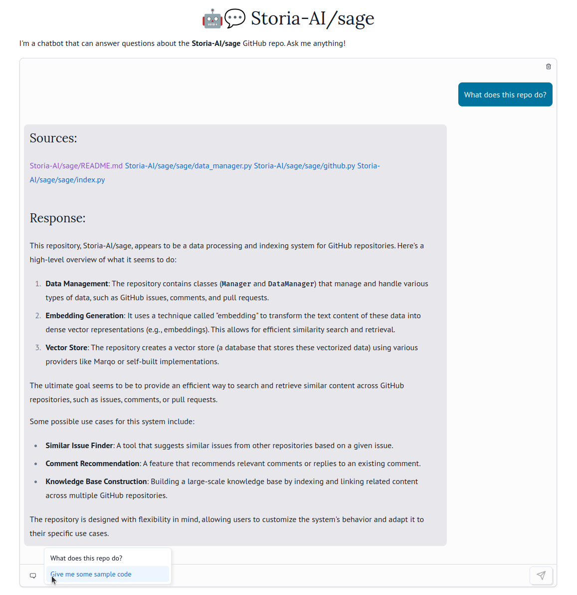

# Sage: chat with any codebase 🤖💬

This example shows how to create a notebook that lets you
_chat with any codebase_, using [Sage](https://github.com/storia-ai/sage)
from Storia AI. It uses [`mo.ui.chat`](https://docs.marimo.io/api/inputs/chat.html) with a custom chat function that
implements a RAG-powered search over any GitHub repository of your choosing.
The result is a chatbot that you can use to incrementally explore a codebase
and even its associated GitHub issues.




## Running the chat notebook


### Index a GitHub repo with sage

This notebook has its Python dependencies inlined in it, but you do need
to set up some non-Python dependencies before you can run it. To run locally,
follow these instructions. Get the full instructions at
[the sage repo](https://github.com/storia-ai/sage).


```bash
docker rm -f marqo
docker pull marqoai/marqo:latest
docker run --name marqo -it -p 8882:8882 marqoai/marqo:latest
```

Then install [Ollama](https://github.com/ollama/ollama) and run

```bash
ollama pull llama3.1
```

Next, run

```
pipx install git+https://github.com/Storia-AI/sage.git@main
```

and choose a GitHub repo to index with (eg)

```bash
export GITHUB_REPO=marimo-team/marimo
```

Finally run

```
sage-index $GITHUB_REPO
```

### Run the marimo notebook!

Open the marimo notebook with

```bash
marimo edit --sandbox chat_with_github.py -- $GITHUB_REPO
```

and start chatting with your repo!

You can also deploy this notebook as a web app, with

```bash
marimo run --sandbox chat_with_github.py -- $GITHUB_REPO
```


> [!TIP]
> The [`--sandbox` flag](https://docs.marimo.io/guides/editor_features/package_management.html) opens the notebook in an isolated virtual environment,
> automatically installing the notebook's dependencies 📦

You can also open the notebook without `uv`, with just `marimo edit
chat_with_github_repo.py`; however, you'll need to install the requirements
yourself.
