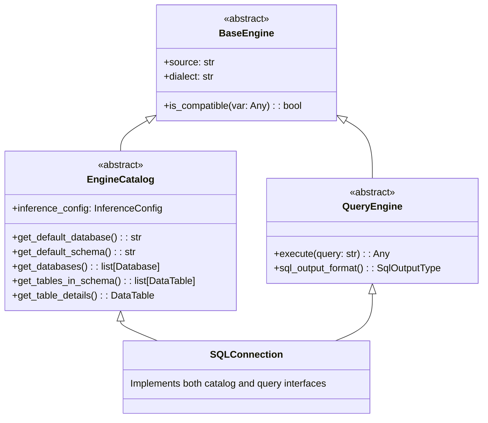

# SQL Engine Architecture

marimo's SQL engine uses a class hierarchy to separate catalog (metadata discovery) and query operations (execution).

## Class Hierarchy

Examples of just the catalog operations:

- PyIceberg

Examples of just the query operations:

- PEP 249

Examples of both catalog and query operations:

- SQLAlchemy/SQLModel
- DuckDB
- Clickhouse
- Ibis
