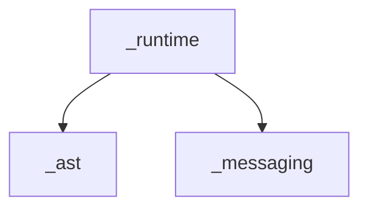

# Dependency Analysis Tests

This directory contains snapshot tests that track the dependency structure of the marimo codebase.

## Generating the DAG

Before running the tests, you need to generate the dependency graph:

```bash
# From the repo root
uvx ruff@0.13.2 analyze graph --direction dependents --detect-string-imports > dag.json
```

This creates a `dag.json` file at the repo root that maps each file to its dependents.

## Running the Tests

```bash
# Run all dependency tests
hatch run test tests/_dependencies/

# Run specific test file
hatch run test tests/_dependencies/test_domain_dependencies.py
hatch run test tests/_dependencies/test_cycles.py

# Update snapshots when changes are intentional
hatch run test tests/_dependencies/ --snapshot-update
```

## What These Tests Track

### 1. Domain Dependencies (`test_domain_dependencies.py`)

Tracks dependencies between major components (second-level folders like `_runtime`, `_messaging`, etc.):

- **Domain DAG**: Shows which domains depend on which
- **Metrics**: Calculates fan-in/fan-out for each domain
- **Visualization**: Generates a Mermaid diagram of domain relationships
- **Isolation Rules**: Enforces architectural constraints (e.g., `_utils` shouldn't depend on domain logic)

**Run directly to see current state:**
```bash
python tests/_dependencies/test_domain_dependencies.py
```

### 2. Circular Dependencies (`test_cycles.py`)

Detects and tracks all circular dependencies:

- **File-Level Cycles**: Individual files that form dependency cycles
- **Strongly Connected Components (SCCs)**: Groups of mutually dependent files
- **Domain-Level Cycles**: High-level architectural cycles between components
- **Statistics**: Tracks how many files are involved in cycles

**Run directly to see current state:**
```bash
python tests/_dependencies/test_cycles.py
```

## When Tests Fail

### Snapshot Mismatch

If tests fail with snapshot mismatches, it means the dependency structure changed:

1. **Review the changes**: Check if the new dependencies are intentional
2. **If changes are good**: Update snapshots with `--snapshot-update`
3. **If changes are bad**: Refactor to remove unwanted dependencies

### Isolation Violations

`test_core_domain_isolation()` enforces architectural rules:

- `_utils` should only depend on other utils or stdlib
- `_ast` should not depend on `_runtime`
- `_config` should have minimal dependencies

If this test fails, refactor to maintain proper layering.

### New Cycles

`test_no_new_cycles_in_core_domains()` prevents cycles in critical domains:

- `_config` and `_utils` must remain cycle-free

If this test fails, you've introduced a circular dependency that needs to be broken.

## Understanding the Output

### Domain Dependencies

```
_runtime:
  -> _ast
  -> _messaging
  -> _config
```

Means: `_runtime` depends on `_ast`, `_messaging`, and `_config`.

### Cycles

```
Cycle 1 (3 files)
  marimo/_runtime/runtime.py
    ↓
  marimo/_messaging/ops.py
    ↓
  marimo/_runtime/runtime.py
```

Shows a circular dependency that should be broken.

### Mermaid Diagram

The domain dependencies test generates a Mermaid diagram you can view on GitHub or with a Mermaid viewer:



## Best Practices

1. **Run tests before committing**: Catch unintended dependencies early
2. **Keep snapshots updated**: Don't let them drift from reality
3. **Break cycles**: Circular dependencies make code harder to test and maintain
4. **Respect layers**: Don't let low-level code depend on high-level code
5. **Review domain changes**: Changes to domain dependencies are architectural decisions

## CI Integration

Add to your CI pipeline:

```yaml
- name: Generate dependency graph
  run: uvx ruff@0.13.2 analyze graph --direction dependents --detect-string-imports > dag.json

- name: Run dependency tests
  run: hatch run test tests/_dependencies/
```

This ensures the dependency structure is tracked over time.
